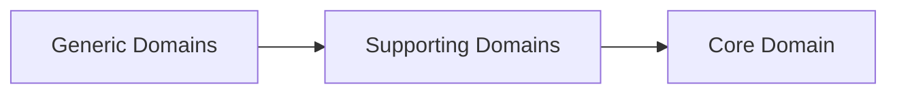

# COS-DDD-002 — Domain Landscape

**Status:** Reviewed
**Version:** 0.1  
**Iteration:** Domain-Driven Design  
**Owner:** Competency Operating System (COS)  
**Last Updated:** 2026-07-04

---

# Purpose (EN)

This document defines the strategic domain landscape of the Competency Operating System (COS).

Its purpose is to identify the major business domains that compose the platform and classify them according to Domain-Driven Design strategic design principles.

This document establishes the business boundaries of the system before introducing Bounded Contexts.

---

# Назначение (RU)

Документ определяет стратегическую карту предметной области Competency Operating System (COS).

Его задача — выделить основные предметные области платформы и классифицировать их в соответствии с принципами стратегического проектирования Domain-Driven Design.

Документ определяет бизнес-границы системы до перехода к проектированию Bounded Context.

---

# Scope (EN)

This document defines:

- Core Domain;
- Supporting Domains;
- Generic Domains;
- relationships between strategic domains;
- domain ownership.

This document intentionally excludes:

- Bounded Contexts;
- entities;
- aggregates;
- services;
- events;
- implementation.

---

# Область документа (RU)

Документ определяет:

- Core Domain;
- Supporting Domains;
- Generic Domains;
- взаимосвязи между стратегическими областями;
- границы ответственности.

Документ не определяет:

- Bounded Context;
- сущности;
- агрегаты;
- сервисы;
- события;
- программную реализацию.

---

# Domain Landscape (EN)

The Competency Operating System consists of three strategic domain categories.

## Core Domain

The Core Domain represents the unique competitive advantage of COS.

It contains the business knowledge that cannot be replaced by standard software solutions.

Domains included:

- Adaptive Competency Development
- Development Intelligence
- Competency Evaluation
- Development Path Intelligence
- Adaptive Decision Engine

These domains differentiate COS from traditional LMS, LXP and HR platforms.

---

## Supporting Domains

Supporting Domains enable the Core Domain but do not define the competitive advantage.

Domains included:

- Learning Content Management
- Assessment Delivery
- Simulation Management
- Methodology Management
- Evidence Collection
- Analytics & Reporting

These capabilities support competency development but are not valuable independently.

---

## Generic Domains

Generic Domains represent common software capabilities available in many enterprise systems.

Domains included:

- Identity & Access Management
- User Management
- Organization Management
- Notifications
- File Storage
- Search
- Localization
- Audit Logging
- Integrations

These domains should leverage established engineering practices and avoid unnecessary custom development.

---

# Карта предметной области (RU)

Competency Operating System состоит из трех стратегических категорий предметной области.

## Core Domain

Core Domain представляет уникальную ценность платформы.

Именно здесь сосредоточена бизнес-логика, отличающая COS от других образовательных систем.

В состав Core Domain входят:

- Адаптивное развитие компетенций
- Интеллект развития
- Оценка компетенций
- Интеллект пути развития
- Адаптивный движок принятия решений

Эти области формируют конкурентное преимущество платформы.

---

## Supporting Domains

Supporting Domains обеспечивают работу Core Domain.

Они необходимы платформе, однако сами по себе не являются источником конкурентного преимущества.

В состав входят:

- Learning Content Management
- Assessment Delivery
- Simulation Management
- Methodology Management
- Evidence Collection
- Analytics & Reporting

-- ru --
- Управление учебным контентом
- Проведение оценивания
- Управление симуляциями
- Управление методологией
- Сбор доказательств
- Аналитика и отчетность
---

## Generic Domains

Generic Domains представляют собой типовые возможности корпоративных информационных систем.

В состав входят:

- Identity & Access Management
- User Management
- Organization Management
- Notifications
- File Storage
- Search
- Localization
- Audit Logging
- Integrations

-- ru --
- Управление идентификацией и доступом
- Управление пользователями
- Управление организацией
- Уведомления
- Хранение файлов
- Поиск
- Локализация
- Аудит логов
- Интеграции

Для данных областей предпочтительно использовать стандартные инженерные решения вместо разработки уникальной бизнес-логики.

---

# Strategic Domain Relationships (EN)

---

# Стратегические взаимосвязи (RU)

Core Domain использует Supporting Domains как вспомогательные бизнес-возможности.

Supporting Domains, в свою очередь, опираются на Generic Domains для реализации универсальных функций платформы.

Зависимость всегда направлена к Core Domain.

---

# Design Principles (EN)

The strategic landscape follows these principles:

- Competitive advantage exists only in the Core Domain.
- Supporting Domains exist solely to enhance the Core Domain.
- Generic Domains should remain generic.
- Business complexity must concentrate inside the Core Domain.
- Every future Bounded Context must belong to one strategic domain.

---

# Принципы проектирования (RU)

Стратегическая карта строится по следующим принципам:

- Конкурентное преимущество сосредоточено только в Core Domain.
- Supporting Domains существуют для поддержки Core Domain.
- Generic Domains не должны содержать уникальной бизнес-логики.
- Основная сложность системы концентрируется в Core Domain.
- Каждый будущий Bounded Context должен относиться к одной из стратегических областей.

---

# Out of Scope (EN)

The following topics are intentionally excluded:

- Context Mapping;
- Bounded Contexts;
- Domain Model;
- Aggregates;
- Events;
- Services;
- Architecture.

---

# Не входит в область документа (RU)

Документ намеренно не рассматривает:

- Контекстное отображение;
- Ограниченный контекст;
- Модель домена;
- Агрегаты;
- События;
- Сервисы;
- Архитектуру.

---

# Related Documents

- Foundation Book v0.3
- COS-DDD-001 — Core Domain
- COS-DDD-003 — Bounded Context Map
- COS Engineering Standard

---

# Decision Log

## Decision

The COS business landscape is divided into Core, Supporting and Generic Domains.

## Rationale

This separation concentrates business innovation within the Core Domain while minimizing unnecessary complexity in supporting and generic capabilities.

## Consequences

All future Bounded Contexts must be classified according to this strategic landscape before detailed tactical modeling begins.