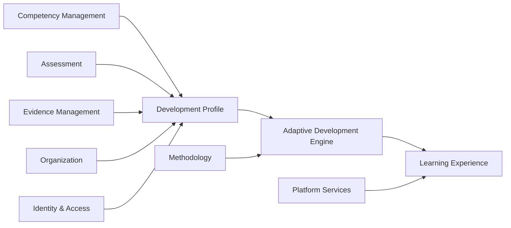

# COS-DDD-003 — Bounded Context Map

**Status:** Reviewed
**Version:** 0.1  
**Iteration:** Domain-Driven Design  
**Owner:** Competency Operating System (COS)  
**Last Updated:** 2026-07-04

---

# Purpose (EN)

This document defines the Bounded Context Map of the Competency Operating System (COS).

Its purpose is to identify the autonomous business contexts that compose the platform, define their responsibilities and establish the strategic boundaries between them.

Each Bounded Context represents an independent business model with its own terminology, rules and lifecycle.

---

# Назначение (RU)

Документ определяет карту ограниченных контекстов (Bounded Context Map) платформы Competency Operating System (COS).

Его задача — выделить независимые бизнес-контексты платформы, определить их зоны ответственности и установить стратегические границы между ними.

Каждый ограниченный контекст (Bounded Context) представляет собой самостоятельную предметную область со своей терминологией, правилами и жизненным циклом.

---

# Scope (EN)

This document defines:

- the complete list of Bounded Contexts;
- the responsibility of each context;
- strategic relationships between contexts;
- ownership of business capabilities.

This document intentionally excludes:

- entities;
- aggregates;
- events;
- services;
- APIs;
- implementation details.

---

# Область документа (RU)

Документ определяет:

- полный перечень ограниченных контекстов;
- ответственность каждого контекста;
- стратегические взаимосвязи;
- распределение бизнес-возможностей.

Документ не рассматривает:

- сущности;
- агрегаты;
- доменные события;
- сервисы;
- API;
- детали реализации.

---

# Bounded Contexts (EN)

## 1. Competency Management

Responsible for defining, organizing and maintaining competencies, capability structures and competency relationships.

---

## 2. Development Profile

Maintains the current state of a person's competency development.

Represents the digital model of learner growth.

---

## 3. Assessment

Responsible for measuring competency maturity through assessments, diagnostics and evaluations.

---

## 4. Adaptive Development Engine

Determines the optimal development path based on competency state, goals and evidence.

This is the strategic intelligence core of COS.

---

## 5. Learning Experience

Provides development activities, learning objects, simulations and educational experiences.

---

## 6. Methodology

Stores development methodologies, competency frameworks and educational strategies.

---

## 7. Evidence Management

Collects and validates evidence confirming competency development.

---

## 8. Organization

Represents companies, educational institutions, teams and organizational structures.

---

## 9. Identity & Access

Manages authentication, authorization and user identity.

---

## 10. Platform Services

Provides generic platform capabilities including notifications, search, storage, localization and integrations.

---

# Ограниченные контексты (RU)

## 1. Управление компетенциями (Competency Management)

Отвечает за определение, структуру и взаимосвязи компетенций.

---

## 2. Профиль развития (Development Profile)

Поддерживает актуальное состояние развития компетенций пользователя.

Представляет цифровую модель профессионального развития человека.

---

## 3. Оценка (Assessment)

Отвечает за диагностику, оценку и измерение уровня развития компетенций.

---

## 4. Адаптивный движок развития (Adaptive Development Engine)

Определяет оптимальную траекторию дальнейшего развития на основе текущего состояния компетенций, целей и подтвержденных результатов.

Является интеллектуальным ядром платформы.

---

## 5. Образовательный опыт (Learning Experience)

Предоставляет пользователю образовательные активности, материалы, симуляции и другие инструменты развития.

---

## 6. Методология (Methodology)

Хранит методологии развития, модели компетенций и образовательные стратегии.

---

## 7. Управление доказательствами (Evidence Management)

Собирает и подтверждает доказательства сформированности компетенций.

---

## 8. Организация (Organization)

Описывает компании, образовательные учреждения, команды и организационные структуры.

---

## 9. Управление идентификацией и доступом (Identity & Access)

Отвечает за пользователей, аутентификацию и управление правами доступа.

---

## 10. Платформенные сервисы (Platform Services)

Предоставляет общие возможности платформы:

- уведомления;
- поиск;
- хранение файлов;
- локализацию;
- интеграции.

---

# Context Relationships (EN)

---

# Взаимосвязи контекстов (RU)

- **Competency Management** определяет модель компетенций.
- **Development Profile** хранит текущее состояние развития.
- **Assessment** обновляет профиль развития.
- **Evidence Management** подтверждает результаты развития.
- **Methodology** определяет правила развития.
- **Adaptive Development Engine** анализирует данные и строит персональную траекторию.
- **Learning Experience** реализует выбранную стратегию развития.
- **Organization** предоставляет организационный контекст.
- **Identity & Access** обеспечивает безопасный доступ.
- **Platform Services** предоставляют общие сервисы платформы.

---

# Design Principles (EN)

Every Bounded Context has:

- a single business responsibility;
- independent business terminology;
- clear ownership;
- minimal coupling;
- explicit boundaries.

Each business rule must have a single authoritative owner.

Other Bounded Contexts may reference the same concepts, but they must not redefine or own business rules that belong to another context.

---

# Принципы проектирования (RU)

Каждый ограниченный контекст обладает:

- одной основной бизнес-ответственностью;
- собственной терминологией;
- четко определенной областью ответственности;
- минимальными зависимостями;
- явными границами.

Каждое бизнес-правило должно иметь единственный источник ответственности.

Другие ограниченные контексты могут использовать те же понятия, но не должны переопределять или владеть бизнес-правилами, относящимися к другому контексту.

---

# Out of Scope (EN)

This document does not define:

- entities;
- aggregates;
- value objects;
- domain services;
- domain events;
- implementation.

---

# Не входит в область документа (RU)

Документ не определяет:

- сущности;
- агрегаты;
- объекты-значения (Value Objects);
- доменные сервисы;
- доменные события;
- реализацию системы.

---

# Related Documents

- Foundation Book v0.3
- COS-DDD-001 — Core Domain
- COS-DDD-002 — Domain Landscape
- COS-DDD-004 — Ubiquitous Language

---

# Decision Log

## Decision

The Competency Operating System is divided into ten independent Bounded Contexts.

## Rationale

Each context encapsulates a distinct business capability, has a single responsibility and can evolve independently while remaining aligned with the strategic domain landscape.

## Consequences

All tactical Domain-Driven Design artifacts (entities, aggregates, events and services) must be defined within one and only one Bounded Context.