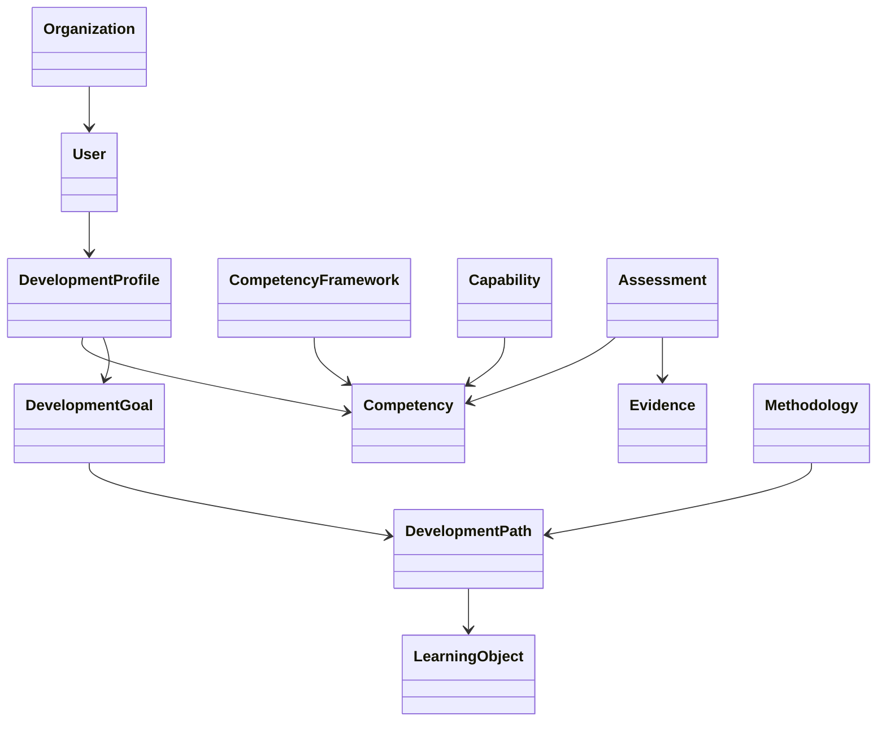

# COS-DDD-005 — Domain Model

**Status:** Reviewed
**Version:** 0.1  
**Iteration:** Domain-Driven Design  
**Owner:** Competency Operating System (COS)  
**Last Updated:** 2026-07-04

---

# Purpose (EN)

This document defines the conceptual Domain Model of the Competency Operating System (COS).

Its purpose is to identify the primary business objects of the platform and describe the relationships between them, independent of implementation, storage or software architecture.

The Domain Model represents the conceptual structure of the business rather than technical classes or database entities.

---

# Назначение (RU)

Документ определяет концептуальную модель предметной области (Domain Model) платформы Competency Operating System (COS).

Его задача — определить основные бизнес-объекты платформы и показать связи между ними независимо от реализации, хранения данных или программной архитектуры.

Domain Model описывает структуру предметной области, а не классы программы или таблицы базы данных.

---

# Scope (EN)

This document defines:

- primary business concepts;
- conceptual relationships;
- business ownership;
- domain dependencies.

This document intentionally excludes:

- aggregates;
- value objects;
- lifecycle;
- events;
- services;
- implementation.

---

# Область документа (RU)

Документ определяет:

- основные бизнес-понятия;
- концептуальные связи;
- принадлежность объектов предметной области;
- зависимости между объектами.

Документ не рассматривает:

- агрегаты;
- объекты-значения (Value Objects);
- жизненные циклы;
- события;
- сервисы;
- реализацию.

---

# Primary Domain Objects (EN)

The conceptual model of COS is built around the following primary business objects.

| Domain Object | Purpose |
|--------------|---------|
| Competency | Represents a measurable capability that can be developed and evaluated. |
| Capability | Groups multiple related competencies into a broader ability. |
| Competency Framework | Defines the structure and relationships between competencies. |
| Development Profile | Represents the current competency state of a person. |
| Development Goal | Describes the desired future competency state. |
| Development Path | Represents the adaptive sequence of development activities. |
| Assessment | Measures competency maturity. |
| Evidence | Confirms competency development. |
| Learning Object | Supports competency development. |
| Methodology | Defines how competency development should occur. |
| Organization | Defines the organizational environment. |
| User | Represents the participant of competency development. |

---

# Основные объекты предметной области (RU)

Концептуальная модель COS строится вокруг следующих бизнес-объектов.

| Объект предметной области | Назначение |
|--------------------------|------------|
| Компетенция | Измеримая способность, которую можно развивать и оценивать. |
| Способность | Объединяет несколько компетенций в более широкую область развития. |
| Модель компетенций | Определяет структуру и взаимосвязи компетенций. |
| Профиль развития | Описывает текущее состояние развития компетенций пользователя. |
| Цель развития | Определяет желаемое состояние развития. |
| Траектория развития | Представляет последовательность действий по развитию компетенций. |
| Оценка | Измеряет уровень развития компетенций. |
| Доказательство | Подтверждает факт развития компетенции. |
| Образовательный объект | Используется для развития компетенций. |
| Методология | Определяет правила развития компетенций. |
| Организация | Представляет организационную среду развития. |
| Пользователь | Участник процесса развития компетенций. |

---

# Conceptual Relationships (EN)

---

# Концептуальные взаимосвязи (RU)

Предметная область строится вокруг следующих принципов:

- Пользователь обладает профилем развития.
- Профиль развития содержит сведения о компетенциях.
- Компетенции объединяются в способности.
- Модель компетенций определяет структуру компетенций.
- Цель развития определяет направление развития.
- Для достижения цели строится траектория развития.
- Траектория использует образовательные объекты.
- Оценка измеряет развитие компетенций.
- Доказательства подтверждают результаты оценки.
- Методология определяет правила формирования траектории развития.
- Организация предоставляет контекст развития пользователя.

---

# Design Principles (EN)

The Domain Model follows these principles:

- Every object represents a business concept.
- Objects are technology-independent.
- Relationships represent business meaning rather than data structure.
- The model is stable and implementation-agnostic.

---

# Принципы проектирования (RU)

Модель предметной области строится по следующим принципам:

- Каждый объект представляет бизнес-понятие.
- Объекты не зависят от технологий.
- Связи отражают смысл предметной области, а не структуру хранения данных.
- Модель должна оставаться стабильной независимо от реализации.

---

# Out of Scope (EN)

This document intentionally excludes:

- Aggregates;
- Value Objects;
- Domain Events;
- Domain Services;
- Application Services;
- Infrastructure.

---

# Не входит в область документа (RU)

Документ намеренно не рассматривает:

- агрегаты;
- объекты-значения;
- доменные события;
- доменные сервисы;
- прикладные сервисы;
- инфраструктуру.

---

# Related Documents

- Foundation Book v0.3
- COS-DDD-001 — Core Domain
- COS-DDD-002 — Domain Landscape
- COS-DDD-003 — Bounded Context Map
- COS-DDD-004 — Ubiquitous Language
- COS-DDD-006 — Aggregates & Invariants

---

# Decision Log

## Decision

The conceptual Domain Model of COS is centered around competency development and the business objects required to describe, evaluate and guide that process.

## Rationale

The model separates business concepts from implementation details, providing a stable conceptual foundation for tactical Domain-Driven Design.

## Consequences

All future entities, aggregates, domain events and services must originate from the business objects defined in this document.