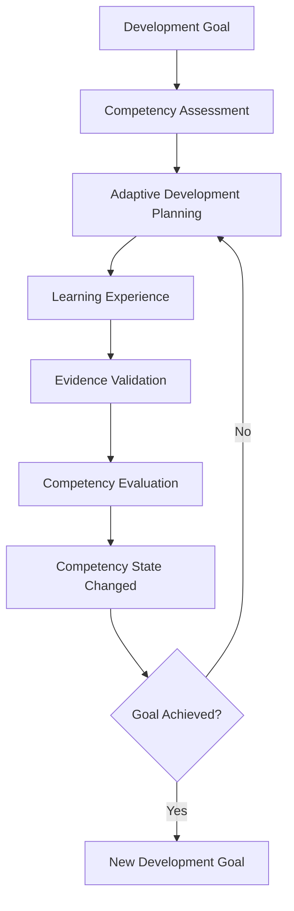
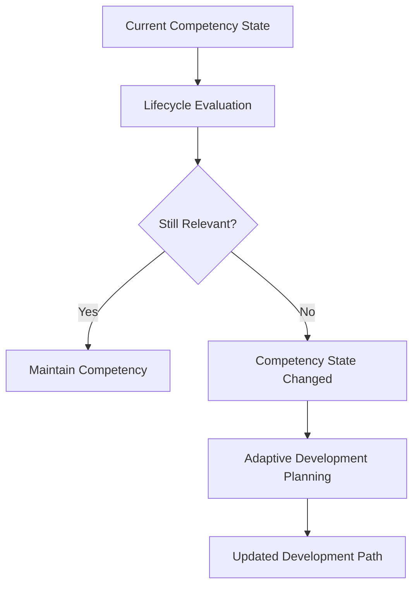

# COS-DDD-009 — Business Processes

**Status:** In Review  
**Version:** 0.1  
**Iteration:** Domain-Driven Design  
**Owner:** Competency Operating System (COS)  
**Last Updated:** 2026-07-05

---

# Purpose (EN)

This document defines the core business processes of the Competency Operating System (COS).

Business Processes describe how the domain evolves over time through coordinated interactions between Aggregates, Domain Services and Domain Events.

Unlike workflow diagrams or user scenarios, these processes represent the continuous business lifecycle of competency development.

---

# Назначение (RU)

Документ определяет основные бизнес-процессы платформы Competency Operating System (COS).

Бизнес-процессы описывают, каким образом предметная область изменяется во времени благодаря совместной работе агрегатов, доменных сервисов и доменных событий.

В отличие от пользовательских сценариев или технических workflow, данные процессы отражают непрерывный жизненный цикл развития компетенций.

---

# Scope (EN)

This document defines:

- Core Business Processes;
- Supporting Business Processes;
- business interactions between Bounded Contexts;
- participating Domain Services;
- produced Domain Events;
- expected business outcomes.

This document intentionally excludes:

- UI flows;
- technical workflows;
- APIs;
- implementation details.

---

# Область документа (RU)

Документ определяет:

- основные бизнес-процессы;
- поддерживающие бизнес-процессы;
- взаимодействие ограниченных контекстов;
- участвующие доменные сервисы;
- создаваемые доменные события;
- ожидаемые бизнес-результаты.

Документ не рассматривает:

- пользовательские интерфейсы;
- технические сценарии;
- API;
- детали реализации.

---

# Business Process Principles (EN)

A Business Process represents the continuous evolution of the domain rather than a sequence of user actions.

Business Processes coordinate Aggregates through Domain Services while communicating state transitions using Domain Events.

Together, all business processes form the Development Journey of an individual.

---

# Принципы бизнес-процессов (RU)

Бизнес-процесс представляет собой непрерывную эволюцию предметной области, а не последовательность действий пользователя.

Бизнес-процессы координируют работу агрегатов посредством Domain Services и фиксируют изменения состояния предметной области через Domain Events.

Совокупность всех бизнес-процессов образует Development Journey (Путь развития) пользователя.

---

# Core Business Processes

---

# Process 1

## Competency Development Cycle

### Purpose (EN)

Represents the continuous business cycle through which competencies are assessed, developed, validated and continuously improved.

---

### Назначение (RU)

Представляет непрерывный цикл развития компетенций, в рамках которого компетенции оцениваются, развиваются, подтверждаются и постоянно совершенствуются.

---

### Business Context (EN)

Competency development never truly ends.

Completion of one development cycle naturally initiates the next stage of personal or professional growth.

---

### Бизнес-контекст (RU)

Развитие компетенций не имеет конечной точки.

Завершение одного цикла развития естественным образом становится началом следующего этапа профессионального или личного роста.

---

### Business Flow

---

### Participating Bounded Contexts

- Development Profile
- Assessment
- Learning Experience
- Evidence Management
- Methodology

---

### Участвующие ограниченные контексты

- Профиль развития
- Оценка компетенций
- Образовательный опыт
- Управление доказательствами
- Методология

---

### Participating Domain Services

- Adaptive Development Service
- Competency Evaluation Service
- Development Planning Service

---

### Участвующие Domain Services

- Сервис адаптивного развития
- Сервис оценки компетенций
- Сервис планирования развития

---

### Produced Domain Events

- Competency State Changed
- Development Path Changed
- Development Goal State Changed

---

### Создаваемые Domain Events

- Изменение состояния компетенции
- Изменение траектории развития
- Изменение состояния цели развития

---

### Business Value (EN)

Provides continuous competency evolution instead of isolated learning activities.

---

### Ценность для бизнеса (RU)

Обеспечивает непрерывное развитие компетенций вместо разрозненных образовательных активностей.

---

### Expected Outcome (EN)

The learner continuously evolves through adaptive development cycles.

---

### Ожидаемый результат (RU)

Пользователь непрерывно развивается благодаря последовательным адаптивным циклам развития.

---

# Process 2

## Adaptive Development Planning

### Purpose (EN)

Creates and continuously updates personalized development strategies.

---

### Назначение (RU)

Формирует и регулярно корректирует персональную стратегию развития.

---

### Business Context (EN)

Development planning adapts to changes in competency state, methodology, evidence and organizational requirements.

---

### Бизнес-контекст (RU)

План развития постоянно адаптируется в зависимости от изменений состояния компетенций, методологии, доказательств и требований организации.

---

### Participating Domain Services

- Adaptive Development Service
- Methodology Resolution Service

---

### Участвующие Domain Services

- Сервис адаптивного развития
- Сервис выбора методологии

---

### Produced Domain Events

- Development Path Changed

---

### Создаваемые Domain Events

- Изменение траектории развития

---

### Business Value (EN)

Ensures every learner follows the most appropriate development path.

---

### Ценность для бизнеса (RU)

Обеспечивает каждому пользователю наиболее подходящую стратегию развития.

---

# Process 3

## Competency Assessment

### Purpose (EN)

Determines the current competency state of an individual.

---

### Назначение (RU)

Определяет текущее состояние компетенций пользователя.

---

### Business Context (EN)

Assessment serves as the primary mechanism for understanding competency maturity and validating development progress.

---

### Бизнес-контекст (RU)

Оценка является основным механизмом определения уровня зрелости компетенций и подтверждения прогресса развития.

---

### Participating Domain Services

- Competency Evaluation Service
- Evidence Validation Service

---

### Участвующие Domain Services

- Сервис оценки компетенций
- Сервис проверки доказательств

---

### Produced Domain Events

- Assessment Completed
- Competency State Changed

---

### Создаваемые Domain Events

- Оценка завершена
- Изменение состояния компетенции

---

### Business Value (EN)

Provides reliable information for adaptive decision-making.

---

### Ценность для бизнеса (RU)

Предоставляет достоверную информацию для принятия адаптивных решений.

# Process 4

## Competency Lifecycle Management

### Purpose (EN)

Monitors competency evolution throughout the entire professional lifecycle.

The process continuously evaluates competency growth, degradation, relevance and the need for revalidation.

---

### Назначение (RU)

Управляет жизненным циклом компетенций на протяжении всей профессиональной деятельности человека.

Процесс непрерывно оценивает развитие, деградацию, актуальность компетенций и необходимость их повторного подтверждения.

---

### Business Context (EN)

Competencies are dynamic business assets.

Their value changes over time depending on practice, experience, assessment results, evidence and changing professional requirements.

---

### Бизнес-контекст (RU)

Компетенции являются динамическими бизнес-активами.

Их ценность изменяется с течением времени под влиянием практики, опыта, результатов оценки, подтвержденных доказательств и изменения профессиональных требований.

---

### Business Flow

---

### Participating Bounded Contexts

- Development Profile
- Competency
- Assessment
- Evidence Management
- Methodology

---

### Участвующие ограниченные контексты

- Профиль развития
- Компетенции
- Оценка компетенций
- Управление доказательствами
- Методология

---

### Participating Domain Services

- Competency Lifecycle Service
- Competency Evaluation Service

---

### Участвующие Domain Services

- Сервис жизненного цикла компетенций
- Сервис оценки компетенций

---

### Produced Domain Events

- Competency State Changed

---

### Создаваемые Domain Events

- Изменение состояния компетенции

---

### Business Rules (EN)

- competencies may improve;
- competencies may degrade;
- competencies may become obsolete;
- competencies may require revalidation;
- competency history is never lost.

---

### Бизнес-правила (RU)

- компетенции могут развиваться;
- компетенции могут деградировать;
- компетенции могут терять актуальность;
- компетенции могут требовать повторного подтверждения;
- история развития компетенций никогда не удаляется.

---

### Business Value (EN)

Transforms competency management from a static certification model into a continuous intelligence process.

---

### Ценность для бизнеса (RU)

Преобразует управление компетенциями из модели статичной сертификации в непрерывный интеллектуальный процесс.

---

### Expected Outcome (EN)

Competencies remain relevant throughout the learner's professional lifecycle.

---

### Ожидаемый результат (RU)

Компетенции пользователя остаются актуальными на протяжении всей профессиональной деятельности.

---

# Process 5

## Evidence Validation

### Purpose (EN)

Validates evidence confirming competency development before it influences the domain model.

---

### Назначение (RU)

Проверяет достоверность доказательств развития компетенций до их использования в предметной области.

---

### Business Context (EN)

Evidence represents objective confirmation of competency development.

Only verified evidence may influence competency state.

---

### Бизнес-контекст (RU)

Доказательства являются объективным подтверждением развития компетенций.

Только подтвержденные доказательства могут влиять на состояние компетенций.

---

### Participating Domain Services

- Evidence Validation Service

---

### Участвующие Domain Services

- Сервис проверки доказательств

---

### Produced Domain Events

- Evidence Verified

---

### Создаваемые Domain Events

- Доказательство подтверждено

---

### Business Value (EN)

Ensures trustworthiness of competency evaluation.

---

### Ценность для бизнеса (RU)

Обеспечивает достоверность оценки компетенций.

---

# Process 6

## Organizational Development Governance

### Purpose (EN)

Applies organization-specific competency policies while preserving the integrity of the core development model.

---

### Назначение (RU)

Применяет правила развития конкретной организации, сохраняя целостность основной модели развития компетенций.

---

### Business Context (EN)

Organizations may define mandatory competencies, certification rules and development standards without changing the core domain.

---

### Бизнес-контекст (RU)

Организации могут определять обязательные компетенции, правила сертификации и стандарты развития без изменения базовой предметной модели COS.

---

### Participating Domain Services

- Organization Policy Service

---

### Участвующие Domain Services

- Сервис организационных политик

---

### Produced Domain Events

- Organization Policy Changed

---

### Создаваемые Domain Events

- Изменение организационной политики

---

### Business Value (EN)

Allows COS to support different organizations while preserving a unified domain model.

---

### Ценность для бизнеса (RU)

Позволяет использовать COS в различных организациях, сохраняя единую предметную модель.

---

# Development Journey

## Definition (EN)

The collection of all business processes described in this document forms the **Development Journey**.

Development Journey is not a domain entity.

It is a conceptual representation of continuous competency evolution throughout an individual's professional life.

---

## Определение (RU)

Совокупность всех бизнес-процессов, описанных в данном документе, образует **Путь развития (Development Journey)**.

Development Journey не является сущностью предметной области.

Это концептуальное представление непрерывной эволюции компетенций человека на протяжении всей профессиональной деятельности.

---

# Design Principles (EN)

Business Processes within COS follow these principles:

- development is continuous;
- competency state changes over time;
- business decisions are adaptive;
- evidence supports every significant competency transition;
- every completed cycle becomes the starting point for the next.

---

# Принципы проектирования (RU)

Бизнес-процессы COS строятся на следующих принципах:

- развитие является непрерывным процессом;
- состояние компетенций изменяется во времени;
- бизнес-решения принимаются адаптивно;
- каждое значимое изменение компетенции подтверждается доказательствами;
- завершение одного цикла развития становится началом следующего.

---

# Traceability

## Foundation

- Product Vision
- Product Manifesto
- Architecture Principles

---

## Foundation (RU)

- Видение продукта
- Манифест продукта
- Архитектурные принципы

---

## Related DDD

- COS-DDD-005 — Domain Model
- COS-DDD-006 — Aggregates & Invariants
- COS-DDD-007 — Domain Events
- COS-DDD-008 — Domain Services

---

## Связанные документы DDD

- COS-DDD-005 — Модель предметной области
- COS-DDD-006 — Агрегаты и бизнес-инварианты
- COS-DDD-007 — Доменные события
- COS-DDD-008 — Доменные сервисы

---

## Next

- COS-DDD-010 — Cross-context Relationships

---

## Следующий документ

- COS-DDD-010 — Взаимодействие ограниченных контекстов

---

# Related Documents

- Foundation Book v0.3
- COS-DDD-008 — Domain Services
- COS-DDD-010 — Cross-context Relationships

---

# Связанные документы

- Foundation Book v0.3
- COS-DDD-008 — Доменные сервисы
- COS-DDD-010 — Взаимодействие ограниченных контекстов

---

# Decision Log

## Decision (EN)

Business Processes within COS are modeled as continuous competency development cycles rather than linear learning workflows.

This enables the platform to support lifelong development, continuous adaptation and dynamic competency management.

---

## Решение (RU)

Бизнес-процессы COS моделируются как непрерывные циклы развития компетенций, а не как линейные образовательные сценарии.

Это позволяет платформе поддерживать непрерывное профессиональное развитие, адаптацию и динамическое управление компетенциями.

---

## Rationale (EN)

Continuous competency evolution more accurately represents real professional development than traditional course-based learning models.

---

## Обоснование (RU)

Непрерывная эволюция компетенций значительно точнее отражает реальные процессы профессионального развития по сравнению с традиционной моделью обучения, основанной на прохождении отдельных курсов.

---

## Consequences (EN)

Future Enterprise Architecture, Application Services and Adaptive Development Engine must preserve continuous competency evolution as the primary business principle.

---

## Последствия (RU)

При проектировании Enterprise Architecture, прикладных сервисов и Adaptive Development Engine непрерывное развитие компетенций должно рассматриваться как основной принцип функционирования платформы.