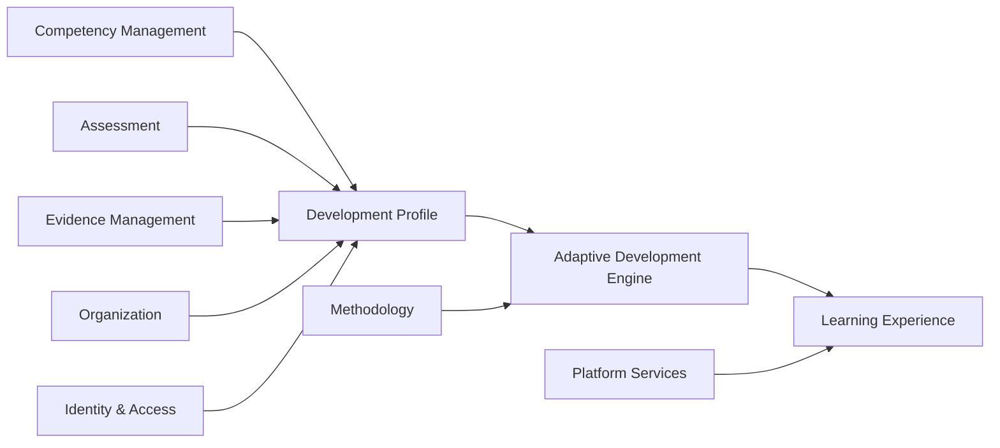
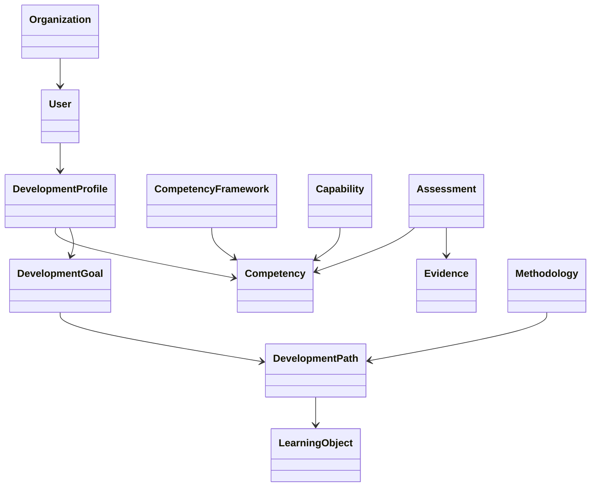
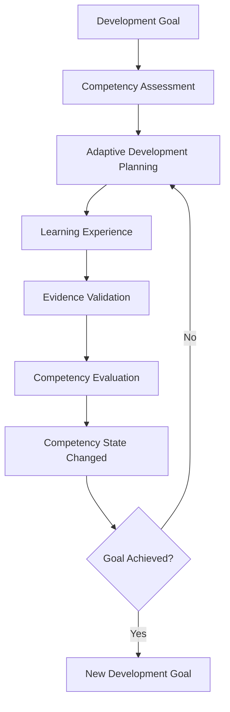
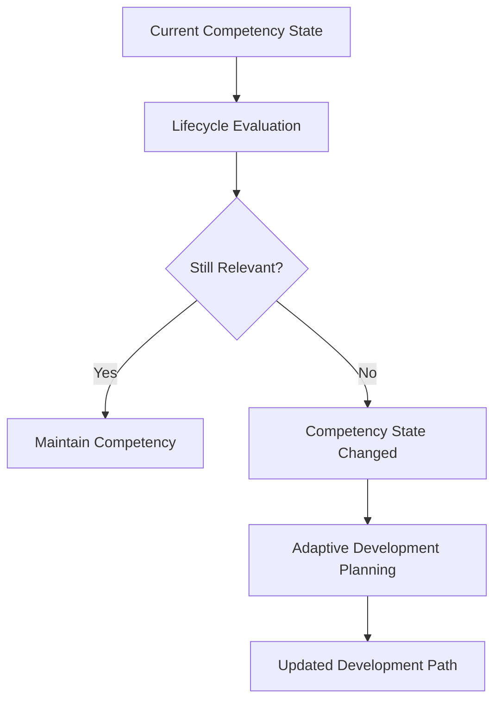

# COS-DDD-SUMMARY — Domain-Driven Design Summary

**Status:** Accepted  
**Version:** 1.0  
**Phase:** Domain-Driven Design  
**Owner:** Competency Operating System (COS)  
**Last Updated:** 2026-07-12

---

# Purpose (EN)

This document summarizes the results of the Domain-Driven Design (DDD) iteration for the Competency Operating System (COS).

Unlike the individual DDD documents, this summary focuses on the architectural knowledge gained during the design process.

Its purpose is not to repeat the documentation, but to explain how the understanding of the domain evolved, why architectural decisions were made and which principles should guide future development.

This document serves as the primary knowledge transfer artifact between architectural iterations and should be read before continuing the design of Enterprise Architecture.

---

# Назначение (RU)

Документ подводит итоги итерации Domain-Driven Design (DDD) для проекта Competency Operating System (COS).

В отличие от отдельных DDD-документов, данное саммари концентрируется не на описании моделей, а на знаниях, полученных в процессе проектирования.

Цель документа — не повторить содержание DDD, а показать, как изменялось понимание предметной области, почему принимались архитектурные решения и какими принципами следует руководствоваться при дальнейшем развитии платформы.

Документ является основным артефактом передачи архитектурных знаний между этапами проектирования и рекомендуется к изучению перед переходом к Enterprise Architecture.

---

# Why the DDD Iteration Was Started (EN)

The Foundation phase established the philosophical and strategic foundation of the Competency Operating System.

It defined:

- the purpose of the platform;
- the product vision;
- the architectural principles;
- the product boundaries;
- the ubiquitous language at a conceptual level.

However, the Foundation Book intentionally avoided describing how the business domain itself should be structured.

The objective of the DDD iteration was therefore to transform strategic product thinking into a precise domain model.

The iteration was deliberately focused on business knowledge rather than technology.

Questions related to databases, APIs, microservices, infrastructure or user interfaces were intentionally excluded.

Instead, every discussion focused on one question:

**How should the business domain of continuous competency development be modeled?**

---

# Почему была начата DDD-итерация (RU)

Этап Foundation сформировал философскую и стратегическую основу Competency Operating System.

В рамках Foundation были определены:

- назначение платформы;
- Product Vision;
- архитектурные принципы;
- границы продукта;
- базовый Ubiquitous Language.

При этом Foundation Book сознательно не описывал внутреннее устройство предметной области.

Поэтому целью DDD-итерации стало преобразование стратегического понимания продукта в строгую модель предметной области.

Работа была намеренно сосредоточена исключительно на бизнес-логике.

Темы, связанные с базами данных, API, микросервисами, инфраструктурой и пользовательскими интерфейсами, были исключены из обсуждения.

Главным вопросом всей итерации стал следующий:

**Каким образом должна быть устроена предметная область непрерывного развития компетенций?**

---

# Scope of the DDD Iteration (EN)

The DDD iteration addressed only business architecture.

The following topics were intentionally included:

- Core Domain identification;
- Domain Landscape;
- Bounded Context definition;
- Ubiquitous Language;
- Domain Model;
- Aggregates;
- Domain Events;
- Domain Services;
- Business Processes;
- Cross-context Relationships.

The following topics were intentionally postponed:

- Enterprise Architecture;
- Application Architecture;
- APIs;
- Integration technologies;
- Data storage;
- Infrastructure;
- User Interface;
- Implementation details.

This separation ensured that technology would later implement the domain rather than influence it.

---

# Область DDD-итерации (RU)

DDD-итерация была полностью посвящена бизнес-архитектуре платформы.

В область проектирования вошли:

- определение Core Domain;
- построение Domain Landscape;
- выделение Bounded Context;
- формирование Ubiquitous Language;
- моделирование предметной области;
- проектирование Aggregates;
- описание Domain Events;
- определение Domain Services;
- моделирование Business Processes;
- описание взаимодействия между контекстами.

Сознательно были отложены:

- Enterprise Architecture;
- Application Architecture;
- API;
- технологии интеграции;
- хранение данных;
- инфраструктура;
- пользовательские интерфейсы;
- детали реализации.

Такое разделение позволило сначала сформировать предметную модель, а затем реализовывать ее техническими средствами без изменения бизнес-смысла.

---

# Documents Produced (EN)

During the iteration the following official architectural documents were created.

| ID | Document |
|----|----------|
| COS-DDD-001 | Core Domain |
| COS-DDD-002 | Domain Landscape |
| COS-DDD-003 | Bounded Context Map |
| COS-DDD-004 | Ubiquitous Language |
| COS-DDD-005 | Domain Model |
| COS-DDD-006 | Aggregates & Invariants |
| COS-DDD-007 | Domain Events |
| COS-DDD-008 | Domain Services |
| COS-DDD-009 | Business Processes |
| COS-DDD-010 | Cross-context Relationships |

Together these documents define the complete business model of the Competency Operating System.

---

# Созданные документы (RU)

В ходе DDD-итерации были подготовлены следующие официальные архитектурные документы.

| ID | Документ |
|----|----------|
| COS-DDD-001 | Core Domain |
| COS-DDD-002 | Domain Landscape |
| COS-DDD-003 | Карта ограниченных контекстов |
| COS-DDD-004 | Единый язык предметной области |
| COS-DDD-005 | Модель предметной области |
| COS-DDD-006 | Агрегаты и инварианты |
| COS-DDD-007 | Доменные события |
| COS-DDD-008 | Доменные сервисы |
| COS-DDD-009 | Бизнес-процессы |
| COS-DDD-010 | Взаимодействие ограниченных контекстов |

Совокупность этих документов образует полную бизнес-модель Competency Operating System.

---

# Evolution of Understanding (EN)

One of the most valuable outcomes of the DDD iteration was not the documentation itself but the gradual evolution of the team's understanding of the product.

At the beginning of the project many concepts were understood intuitively.

During the DDD process those concepts were progressively refined into explicit architectural knowledge.

This evolution significantly changed the perception of the platform.

COS stopped being viewed as an educational platform.

Instead, it became understood as a Development Intelligence Platform whose primary responsibility is managing continuous competency development.

The DDD iteration therefore represents a transition from product vision to formal business architecture.

---

# Эволюция понимания предметной области (RU)

Одним из важнейших результатов DDD-итерации стала не сама документация, а постепенное изменение понимания предметной области.

В начале проекта многие идеи существовали на интуитивном уровне.

По мере разработки DDD они последовательно превращались в формализованные архитектурные знания.

Именно в ходе этой работы изменилось восприятие самой платформы.

COS перестал рассматриваться как образовательная система.

Вместо этого он стал восприниматься как Development Intelligence Platform, основной задачей которой является интеллектуальное сопровождение непрерывного развития компетенций.

Таким образом DDD-итерация стала переходом от продуктовой идеи к полноценной бизнес-архитектуре.

# Domain Understanding Before and After DDD

## Introduction (EN)

The most valuable outcome of the DDD iteration was not the production of documentation itself.

Its greatest value was the gradual refinement of the team's understanding of the business domain.

Many concepts that originally existed only as intuitive product ideas became formal architectural concepts.

The following sections document this evolution.

They should be understood as architectural discoveries rather than implementation decisions.

---

## Введение (RU)

Главным результатом DDD-итерации стала не сама документация.

Наибольшую ценность представляет постепенное развитие понимания предметной области.

Многие идеи, которые первоначально существовали лишь как интуитивные представления о продукте, превратились в формализованные архитектурные концепции.

Ниже приведены основные изменения этого понимания.

Их следует рассматривать как архитектурные открытия, а не как технические решения.

---

# Evolution 01

## Before DDD (EN)

COS was initially perceived as an educational platform built around adaptive learning.

The Adaptive Development Engine appeared to be the central product.

---

## До DDD (RU)

Изначально COS воспринимался как образовательная платформа с интеллектуальным алгоритмом адаптивного обучения.

Adaptive Development Engine казался центральной частью продукта.

---

## After DDD (EN)

COS became understood as a Development Intelligence Platform.

Learning is only one of many instruments supporting development.

The true Core Domain is competency development rather than education.

Adaptive Development Engine became one of the mechanisms implementing that business capability.

---

## После DDD (RU)

После завершения DDD стало понятно, что COS является Development Intelligence Platform.

Обучение представляет собой лишь один из инструментов развития.

Настоящим Core Domain платформы является управление развитием компетенций, а не образовательный процесс.

Adaptive Development Engine оказался механизмом реализации этой бизнес-возможности, а не самим продуктом.

---

# Evolution 02

## Before DDD (EN)

Competencies were implicitly treated as measurable knowledge or skill levels.

---

## До DDD (RU)

Компетенции первоначально воспринимались как измеримые уровни знаний или навыков.

---

## After DDD (EN)

Competencies became understood as dynamic business assets.

Their state changes continuously under the influence of assessment, experience, learning, practice, evidence, organizational requirements and time.

Competencies may improve, decline, become obsolete or require revalidation.

---

## После DDD (RU)

Компетенции стали рассматриваться как динамические бизнес-активы.

Их состояние непрерывно изменяется под влиянием оценки, практического опыта, обучения, подтвержденных доказательств, требований организации и времени.

Компетенции могут развиваться, деградировать, терять актуальность и требовать повторного подтверждения.

---

# Evolution 03

## Before DDD (EN)

Development was perceived as a sequence of educational activities.

---

## До DDD (RU)

Развитие воспринималось как последовательность образовательных мероприятий.

---

## After DDD (EN)

Development became understood as a continuous business lifecycle.

Every completed development cycle naturally initiates a new cycle.

There is no final state of competency development.

---

## После DDD (RU)

Развитие стало рассматриваться как непрерывный жизненный цикл.

Каждый завершенный цикл развития естественным образом становится началом следующего.

Окончательного состояния развития компетенций не существует.

---

# Evolution 04

## Before DDD (EN)

Development Journey appeared to be another domain entity.

---

## До DDD (RU)

Первоначально Development Journey рассматривался как возможная сущность предметной области.

---

## After DDD (EN)

Development Journey became understood as a business concept describing the complete collection of competency development processes.

It is intentionally not modeled as an Entity or Aggregate.

---

## После DDD (RU)

Development Journey был переосмыслен как бизнес-концепция, объединяющая все процессы развития компетенций.

Сознательно было принято решение не моделировать его как Entity или Aggregate.

---

# Evolution 05

## Before DDD (EN)

Business processes were initially viewed as workflow sequences.

---

## До DDD (RU)

Бизнес-процессы первоначально воспринимались как последовательности действий.

---

## After DDD (EN)

Business Processes became representations of domain evolution.

They describe how business state changes over time rather than how users interact with software.

---

## После DDD (RU)

Бизнес-процессы стали рассматриваться как модель эволюции предметной области.

Они описывают изменение бизнес-состояния во времени, а не последовательность действий пользователя в системе.

---

# Key Observation (EN)

Throughout the DDD iteration the understanding of COS gradually shifted from an education-centric platform to a development-centric business system.

This change became the defining architectural insight of the entire iteration.

---

# Ключевое наблюдение (RU)

На протяжении всей DDD-итерации понимание COS постепенно сместилось от образовательной платформы к системе интеллектуального сопровождения развития человека.

Именно это изменение стало главным архитектурным результатом всей итерации.

# Major Architectural Discoveries

## Introduction (EN)

During the DDD iteration, several architectural discoveries fundamentally changed the understanding of the Competency Operating System.

These discoveries were not planned in advance.

They emerged through iterative modeling, discussions and refinement of the business domain.

Each discovery influenced subsequent architectural decisions and should be considered part of the project's architectural knowledge.

---

## Введение (RU)

В процессе DDD-итерации было сделано несколько архитектурных открытий, существенно изменивших понимание Competency Operating System.

Эти открытия не были заранее определены.

Они появились в результате последовательного моделирования предметной области, обсуждений и уточнения бизнес-концепций.

Каждое из них оказало влияние на дальнейшие архитектурные решения и должно рассматриваться как часть архитектурных знаний проекта.

---

# Discovery 01

## Development is not Learning

### Initial Assumption (EN)

Initially the platform was perceived as an adaptive educational system.

### Первоначальное предположение (RU)

Первоначально платформа воспринималась как система адаптивного обучения.

---

### Architectural Discovery (EN)

Learning is only one mechanism of development.

Professional growth also depends on experience, practice, mentoring, assessment, collaboration and organizational context.

The Core Domain therefore became continuous competency development rather than learning management.

### Архитектурное открытие (RU)

Обучение является лишь одним из механизмов развития.

Профессиональный рост также определяется практикой, опытом, наставничеством, оценкой, совместной деятельностью и организационным контекстом.

Поэтому Core Domain платформы был определен как управление развитием компетенций, а не управление обучением.

---

### Why It Matters (EN)

This discovery fundamentally differentiates COS from traditional LMS platforms.

### Почему это важно (RU)

Именно это открытие принципиально отличает COS от классических LMS.

---

### Architectural Impact

Every future subsystem must support development rather than simply deliver educational content.

---

### Архитектурное влияние

Все последующие подсистемы должны поддерживать развитие человека, а не только предоставлять образовательный контент.

---

# Discovery 02

## Competencies are Dynamic Assets

### Initial Assumption (EN)

Competencies initially appeared to be relatively stable characteristics.

### Первоначальное предположение (RU)

Первоначально компетенции рассматривались как относительно стабильные характеристики человека.

---

### Architectural Discovery (EN)

Competencies continuously evolve.

Their state changes under the influence of learning, practical experience, evidence, assessment, organizational requirements and time.

A competency may improve, decline, become obsolete or require revalidation.

### Архитектурное открытие (RU)

Компетенции находятся в постоянном развитии.

Их состояние изменяется под воздействием обучения, практического опыта, подтвержденных доказательств, оценки, требований организации и времени.

Компетенция может развиваться, деградировать, терять актуальность и требовать повторного подтверждения.

---

### Why It Matters

Static competency models cannot accurately represent real professional development.

---

### Почему это важно

Статическая модель компетенций не способна корректно описывать реальное профессиональное развитие человека.

---

### Architectural Impact

Adaptive Development Engine must evaluate competency evolution rather than store competency levels.

---

### Архитектурное влияние

Adaptive Development Engine должен анализировать изменение компетенций во времени, а не просто хранить их текущий уровень.

---

# Discovery 03

## Development Never Ends

### Initial Assumption (EN)

Development was initially modeled as a finite sequence leading to a goal.

### Первоначальное предположение (RU)

Первоначально развитие представлялось как конечный маршрут к определенной цели.

---

### Architectural Discovery (EN)

Development is cyclical.

Every completed development cycle naturally becomes the starting point for another.

The platform therefore supports lifelong competency evolution.

### Архитектурное открытие (RU)

Развитие представляет собой непрерывный цикл.

Каждый завершенный этап становится началом следующего.

Платформа ориентирована на сопровождение человека на протяжении всей профессиональной жизни.

---

### Architectural Impact

Business Processes were redesigned as continuous cycles rather than linear workflows.

---

### Архитектурное влияние

Все бизнес-процессы были переосмыслены как непрерывные циклы, а не как линейные сценарии.

---

# Discovery 04

## Development Journey is a Business Concept

### Initial Assumption (EN)

Development Journey appeared to be another business entity.

### Первоначальное предположение (RU)

Development Journey первоначально рассматривался как возможная сущность предметной области.

---

### Architectural Discovery (EN)

Development Journey describes the complete lifecycle of development.

It is a conceptual model rather than an Entity or Aggregate.

### Архитектурное открытие (RU)

Development Journey описывает полный жизненный цикл развития человека.

Это бизнес-концепция, а не Entity или Aggregate.

---

### Architectural Impact

The concept became part of business terminology without introducing unnecessary complexity into the domain model.

---

### Архитектурное влияние

Development Journey вошел в бизнес-словарь платформы без создания дополнительной сущности предметной области.

---

# Discovery 05

## Adaptive Development Engine is a Domain Subsystem

### Initial Assumption (EN)

The Adaptive Development Engine initially appeared to be a single intelligent algorithm.

### Первоначальное предположение (RU)

Adaptive Development Engine первоначально воспринимался как единый интеллектуальный алгоритм.

---

### Architectural Discovery (EN)

The engine is better understood as a domain subsystem consisting of multiple cooperating Domain Services.

Its responsibility is intelligent coordination of competency development rather than execution of one algorithm.

### Архитектурное открытие (RU)

Adaptive Development Engine следует рассматривать как доменную подсистему, объединяющую несколько Domain Services.

Его задача заключается в интеллектуальной координации процесса развития, а не в выполнении одного алгоритма.

---

### Architectural Impact

Enterprise Architecture should realize the Adaptive Development Engine as a collaboration of business capabilities rather than a monolithic component.

---

### Архитектурное влияние

При разработке Enterprise Architecture Adaptive Development Engine следует реализовывать как совокупность взаимодействующих бизнес-возможностей, а не как единый монолитный модуль.

# Accepted Architectural Decisions

## Introduction (EN)

The following decisions are considered officially accepted as a result of the Domain-Driven Design iteration.

Future architectural work should extend these decisions rather than reinterpret them.

These decisions define the stable architectural foundation of the Competency Operating System.

They should only be reconsidered if new business requirements fundamentally change the purpose of the platform.

---

## Введение (RU)

Следующие решения считаются официально принятыми по результатам Domain-Driven Design итерации.

Дальнейшая архитектурная работа должна развивать эти решения, а не переосмысливать их.

Они формируют стабильный архитектурный фундамент Competency Operating System.

Пересмотр возможен только в случае появления принципиально новых бизнес-требований.

---

# Decision 01

## COS manages development rather than learning.

### EN

The primary responsibility of COS is continuous competency development.

Learning represents only one possible development activity.

The platform must remain equally applicable to learning, mentoring, practice, work experience, certification and any future development methodology.

### RU

Основная задача COS — сопровождение непрерывного развития компетенций.

Обучение является лишь одним из способов развития.

Платформа должна одинаково поддерживать обучение, наставничество, практику, профессиональный опыт, сертификацию и любые будущие методологии развития.

---

# Decision 02

## Competencies are dynamic business assets.

### EN

Competencies are not static characteristics.

Their state evolves throughout a person's professional life.

The platform must support growth, degradation, loss of relevance and revalidation without losing historical information.

### RU

Компетенции не являются статичными характеристиками.

Их состояние изменяется на протяжении всей профессиональной жизни человека.

Платформа должна поддерживать развитие, деградацию, потерю актуальности и повторное подтверждение компетенций без потери истории изменений.

---

# Decision 03

## Development is continuous.

### EN

Professional development has no terminal state.

Every completed development cycle becomes the starting point for a new one.

Business processes must therefore be modeled as continuous cycles instead of finite workflows.

### RU

Профессиональное развитие не имеет конечной точки.

Каждый завершенный цикл развития становится началом следующего.

Поэтому бизнес-процессы моделируются как непрерывные циклы, а не как конечные сценарии.

---

# Decision 04

## Development Journey is a business concept.

### EN

Development Journey is intentionally not represented as an Entity, Aggregate or database object.

It describes the complete evolution of an individual's development across multiple business processes.

### RU

Development Journey сознательно не моделируется как Entity, Aggregate или объект хранения данных.

Это бизнес-концепция, описывающая полный путь развития человека через множество взаимосвязанных бизнес-процессов.

---

# Decision 05

## Adaptive Development Engine is a domain subsystem.

### EN

Adaptive Development Engine is not a single algorithm or application service.

It is a domain subsystem responsible for coordinating intelligent development decisions through multiple collaborating Domain Services.

### RU

Adaptive Development Engine не является отдельным алгоритмом или прикладным сервисом.

Это доменная подсистема, координирующая интеллектуальные решения посредством взаимодействия нескольких Domain Services.

---

# Decision 06

## Domain Services own business decisions.

### EN

Business decisions requiring knowledge from multiple Aggregates belong to Domain Services.

Aggregates protect consistency.

Domain Services coordinate business behavior.

### RU

Бизнес-решения, требующие информации из нескольких агрегатов, относятся к Domain Services.

Агрегаты отвечают за согласованность своих данных.

Domain Services координируют поведение предметной области.

---

# Decision 07

## Domain Events represent business state transitions.

### EN

Domain Events exist to describe meaningful changes in the business domain.

They are part of the ubiquitous language and should not be confused with technical messaging mechanisms.

### RU

Domain Events описывают значимые изменения состояния предметной области.

Они являются частью Ubiquitous Language и не должны отождествляться с техническими механизмами обмена сообщениями.

---

# Decision 08

## Bounded Contexts define ownership of business knowledge.

### EN

Each Bounded Context owns its own business concepts, language and consistency rules.

Contexts collaborate through explicit contracts while preserving autonomy.

### RU

Каждый Bounded Context владеет собственной бизнес-моделью, терминологией и правилами согласованности.

Контексты взаимодействуют через явно определенные контракты, сохраняя независимость друг от друга.

---

# Decision 09

## Enterprise Architecture must implement the domain.

### EN

The purpose of Enterprise Architecture is to realize the business model defined during the DDD iteration.

Technology must adapt to the domain rather than reshape it.

### RU

Цель Enterprise Architecture — реализовать предметную модель, сформированную в ходе DDD.

Технологическая архитектура должна следовать бизнес-модели, а не изменять ее.

---

# Decision 10

## Foundation Book remains the primary source of strategic truth.

### EN

The Foundation Book defines the purpose, principles and boundaries of the platform.

DDD refines those principles into a formal business model but does not replace or reinterpret them.

### RU

Foundation Book определяет назначение, принципы и границы платформы.

DDD формализует эти принципы в предметную модель, но не заменяет и не переосмысливает Foundation Book.

---

# Architectural Lessons Learned

## EN

The DDD iteration demonstrated that the most important architectural decisions emerged through iterative refinement rather than initial planning.

The value of DDD was not the production of diagrams or models.

Its value was the creation of a shared understanding of the business domain.

This shared understanding now represents one of the most valuable assets of the Competency Operating System project.

---

## RU

DDD-итерация показала, что наиболее важные архитектурные решения появились не в результате первоначального проектирования, а в процессе последовательного уточнения модели предметной области.

Главной ценностью DDD стали не диаграммы и не модели.

Главной ценностью стало формирование общего понимания предметной области.

Именно это понимание сегодня является одним из наиболее ценных архитектурных активов проекта Competency Operating System.

# Required Foundation Book Updates

## Introduction (EN)

During the DDD iteration several architectural insights emerged that were not yet reflected in the Foundation Book.

These insights do not change the strategic vision of the platform.

Instead, they clarify and strengthen it.

The following updates should be incorporated into the next revision of the Foundation Book.

---

## Введение (RU)

В процессе DDD-итерации были сформулированы несколько архитектурных выводов, которые пока не отражены в Foundation Book.

Эти выводы не изменяют стратегическое видение платформы.

Они уточняют и усиливают его.

Следующие положения рекомендуется включить в следующую редакцию Foundation Book.

---

## Proposed Updates

### 1. Competencies are Dynamic Assets

**EN**

Competencies should be treated as dynamic business assets rather than static characteristics.

Their state evolves continuously throughout an individual's professional life.

**RU**

Компетенции следует рассматривать как динамические бизнес-активы, а не как статические характеристики.

Их состояние непрерывно изменяется на протяжении всей профессиональной жизни человека.

---

### 2. Development is Continuous

**EN**

Development has no final state.

Every completed development cycle becomes the starting point for the next.

**RU**

Развитие не имеет конечной точки.

Каждый завершенный цикл развития становится началом следующего.

---

### 3. Adaptive Development Engine

**EN**

The Adaptive Development Engine should be defined as a domain subsystem responsible for coordinating intelligent development decisions.

It should not be described as a single algorithm or technical component.

**RU**

Adaptive Development Engine следует определить как доменную подсистему, координирующую интеллектуальные решения о развитии.

Его не следует описывать как единый алгоритм или технический компонент.

---

### 4. Development Journey

**EN**

Development Journey should remain a business concept describing continuous development rather than a domain entity.

**RU**

Development Journey должен оставаться бизнес-концепцией, описывающей непрерывный путь развития, а не сущностью предметной области.

---

### 5. Competency Lifecycle

**EN**

The lifecycle of competencies includes growth, degradation, obsolescence and revalidation.

Historical competency evolution should always be preserved.

**RU**

Жизненный цикл компетенций включает развитие, деградацию, потерю актуальности и повторное подтверждение.

История изменения компетенций должна сохраняться полностью.

---

# Guidance for Future Architects

## EN

Future architectural work should treat the DDD iteration as the established business foundation of the Competency Operating System.

Architectural discussions should focus on extending and implementing the domain model rather than redefining it.

When evaluating new ideas, architects should first determine whether they fit within the existing Core Domain before introducing new concepts.

The integrity of the Core Domain should always take precedence over implementation convenience.

---

## RU

Дальнейшее архитектурное проектирование должно рассматривать результаты DDD как сформированную предметную основу Competency Operating System.

Новые архитектурные решения должны развивать существующую модель, а не переопределять ее.

Перед добавлением новых концепций необходимо определить, соответствуют ли они существующему Core Domain.

Целостность предметной области всегда должна иметь более высокий приоритет, чем удобство реализации.

---

# Guidance for AI Agents

## EN

When continuing work on the Competency Operating System, AI agents should follow these principles:

- treat the Foundation Book as the strategic source of truth;
- treat the DDD documentation as the authoritative business model;
- do not redesign the Core Domain without explicit business justification;
- do not merge Bounded Contexts without a clear domain reason;
- do not introduce implementation details into domain discussions;
- preserve the Ubiquitous Language;
- treat competencies as dynamic business assets;
- model development as a continuous lifecycle;
- use Domain Services for cross-context business decisions;
- keep the Adaptive Development Engine as a domain subsystem;
- preserve the separation between business architecture and technical architecture.

The objective of future iterations is to refine and implement the existing model rather than reinterpret it.

---

## RU

При продолжении работы над Competency Operating System AI-агенты должны придерживаться следующих принципов:

- рассматривать Foundation Book как основной стратегический источник истины;
- рассматривать DDD-документацию как официальную модель предметной области;
- не переопределять Core Domain без появления новых бизнес-требований;
- не объединять Bounded Context без явного обоснования;
- не смешивать обсуждение предметной области с технической реализацией;
- сохранять Ubiquitous Language;
- рассматривать компетенции как динамические бизнес-активы;
- моделировать развитие как непрерывный жизненный цикл;
- использовать Domain Services для принятия межконтекстных бизнес-решений;
- рассматривать Adaptive Development Engine как доменную подсистему;
- сохранять разделение между бизнес-архитектурой и технической архитектурой.

Цель последующих итераций — развивать и реализовывать существующую модель, а не переосмысливать ее.

---

# Transition to Enterprise Architecture

## EN

The Domain-Driven Design iteration established the business architecture of the Competency Operating System.

The platform now possesses:

- a clearly defined Core Domain;
- a complete Domain Landscape;
- bounded contexts and their relationships;
- a shared ubiquitous language;
- business entities and aggregates;
- domain events;
- domain services;
- business processes;
- architectural interaction principles.

The next architectural phase is Enterprise Architecture.

Its responsibility is to realize this business model through applications, integrations, data architecture and technical infrastructure.

Enterprise Architecture must implement the domain—not redefine it.

---

## RU

Итерация Domain-Driven Design сформировала бизнес-архитектуру Competency Operating System.

На данном этапе платформа обладает:

- определенным Core Domain;
- полной картиной предметной области;
- ограниченными контекстами и правилами их взаимодействия;
- единым языком предметной области;
- бизнес-сущностями и агрегатами;
- доменными событиями;
- доменными сервисами;
- бизнес-процессами;
- архитектурными принципами взаимодействия.

Следующим этапом становится Enterprise Architecture.

Ее задача — реализовать сформированную предметную модель посредством прикладной архитектуры, интеграций, архитектуры данных и технической инфраструктуры.

Enterprise Architecture должна реализовать предметную область, а не переопределять ее.

---

# Final Summary

## EN

The DDD iteration transformed the Competency Operating System from a product vision into a complete business architecture.

More importantly, it established a shared understanding of the domain that now serves as the intellectual foundation of the project.

This shared understanding is considered one of the project's most valuable architectural assets.

Future work should preserve, extend and implement this knowledge while maintaining the integrity of the Core Domain.

---

## RU

DDD-итерация преобразовала Competency Operating System из продуктовой концепции в полноценную бизнес-архитектуру.

Еще более важным результатом стало формирование общего понимания предметной области, которое теперь служит интеллектуальным фундаментом проекта.

Это общее понимание следует рассматривать как один из наиболее ценных архитектурных активов Competency Operating System.

Дальнейшая работа должна быть направлена на сохранение, развитие и реализацию этих знаний при неизменном уважении к целостности Core Domain.

---

# DDD Iteration Status

| Phase | Status |
|--------|--------|
| Foundation | ✅ Completed |
| Domain-Driven Design | ✅ Completed |
| Enterprise Architecture | ▶ Ready to Start |

---

# Статус архитектурных этапов

| Этап | Статус |
|------|--------|
| Foundation | ✅ Завершен |
| Domain-Driven Design | ✅ Завершен |
| Enterprise Architecture | ▶ Готов к началу |

# COS-DDD-001 — Core Domain

**Status:** Reviewed  
**Version:** 0.1  
**Iteration:** Domain-Driven Design  
**Owner:** Competency Operating System (COS)  
**Last Updated:** 2026-07-04

---

# Purpose (EN)

This document defines the Core Domain of the Competency Operating System (COS).

Its purpose is to establish the primary business domain of the platform, identify the unique business capability that differentiates COS from conventional learning systems, and define the foundation for all subsequent Domain-Driven Design artifacts.

This document intentionally excludes implementation details, software architecture, infrastructure, APIs and data models.

---

# Назначение (RU)

Документ определяет **Core Domain** платформы Competency Operating System (COS).

Его цель — зафиксировать основную предметную область платформы, определить ключевую бизнес-способность системы и сформировать основу для всех последующих документов Domain-Driven Design.

Документ намеренно не рассматривает вопросы реализации, программной архитектуры, инфраструктуры, API и моделей данных.

---

# Scope (EN)

This document defines:

- the primary business problem;
- the Core Domain of COS;
- the business value created by the platform;
- the strategic focus of the product.

This document does not define:

- entities;
- aggregates;
- bounded contexts;
- domain services;
- business processes;
- software architecture.

---

# Область документа (RU)

Документ определяет:

- основную бизнес-проблему;
- Core Domain платформы COS;
- создаваемую бизнес-ценность;
- стратегический фокус продукта.

Документ не определяет:

- сущности;
- агрегаты;
- Bounded Context;
- доменные сервисы;
- бизнес-процессы;
- программную архитектуру.

---

# Business Problem (EN)

Traditional learning systems primarily manage educational content.

Learning Management Systems (LMS) organize courses.

Learning Experience Platforms (LXP) recommend content.

Competency matrices describe expected skills.

None of these systems continuously model how a person's competencies evolve over time or determine the optimal next development step based on current capability.

As a result:

- learning paths remain static;
- competency gaps remain hidden;
- development is measured by completed activities rather than achieved capabilities;
- organizations cannot objectively manage competency growth.

---

# Бизнес-проблема (RU)

Традиционные образовательные системы преимущественно управляют учебным контентом.

LMS организуют курсы.

LXP рекомендуют материалы.

Матрицы компетенций описывают ожидаемые навыки.

Ни одна из этих систем не моделирует непрерывное развитие компетенций человека и не определяет оптимальный следующий шаг развития на основе текущего состояния.

В результате:

- образовательные траектории остаются статичными;
- дефициты компетенций выявляются недостаточно точно;
- развитие измеряется прохождением материалов, а не изменением компетентности;
- организация не может объективно управлять развитием сотрудников.

---

# Core Domain (EN)

The Core Domain of Competency Operating System is **Adaptive Competency Development**.

The platform continuously models competencies, evaluates their evolution and determines the most effective next development step.

The central business objective of COS is not delivering educational content.

The central objective is improving human capability through adaptive competency development.

Educational content, assessments, simulations, methodologies and learning resources exist only as mechanisms supporting competency evolution.

---

# Core Domain (RU)

Основной предметной областью Competency Operating System является **адаптивное развитие компетенций**.

Платформа непрерывно моделирует компетенции человека, оценивает их развитие и определяет наиболее эффективный следующий шаг развития.

Главной бизнес-задачей COS является не доставка образовательного контента.

Главная задача платформы — развитие человеческих компетенций посредством адаптивного управления процессом развития.

Курсы, оценки, симуляции, методики и образовательные материалы являются инструментами поддержки развития компетенций.

---

# Core Business Capability (EN)

The primary capability of COS is the ability to continuously answer five business questions:

1. What competencies does a person currently possess?
2. What is the maturity level of each competency?
3. Which competency gaps currently exist?
4. What development action should happen next?
5. How has competency changed over time?

---

# Основная бизнес-способность (RU)

Главная бизнес-способность COS заключается в непрерывном ответе на пять вопросов:

1. Какими компетенциями человек обладает сейчас?
2. Каков уровень зрелости каждой компетенции?
3. Какие дефициты существуют?
4. Какой следующий шаг развития наиболее эффективен?
5. Как изменяются компетенции во времени?

---

# Strategic Differentiation (EN)

COS is not an LMS.

COS is not a content platform.

COS is not a competency matrix.

COS is a Development Intelligence Platform whose primary business asset is the competency model.

Everything else supports that model.

---

# Стратегическое отличие (RU)

COS не является LMS.

COS не является платформой образовательного контента.

COS не является матрицей компетенций.

COS представляет собой Development Intelligence Platform, главным бизнес-активом которой является модель компетенций.

Все остальные компоненты платформы существуют для поддержки этой модели.

---

# Core Domain Boundary (EN)

The Core Domain begins when competency development becomes observable and manageable.

The Core Domain ends before implementation concerns such as user interface, databases, communication protocols or infrastructure.

Technology serves the domain.

The domain never depends on technology.

---

# Границы Core Domain (RU)

Core Domain начинается там, где развитие компетенций становится наблюдаемым и управляемым.

Core Domain заканчивается до появления вопросов реализации, интерфейсов, хранения данных, API или инфраструктуры.

Технологии обслуживают предметную область.

Предметная область не зависит от технологий.

---

# Architectural Implications (EN)

This definition establishes several architectural consequences:

- Competency is the primary business object.
- Development is the primary business process.
- Assessment supports development.
- Learning content supports development.
- Adaptive decision-making is part of the Core Domain.
- All future bounded contexts must contribute to competency evolution.

---

# Архитектурные выводы (RU)

Данное определение определяет несколько архитектурных следствий:

- Компетенция является главным бизнес-объектом.
- Развитие является главным бизнес-процессом.
- Оценка поддерживает развитие.
- Контент поддерживает развитие.
- Адаптивное принятие решений относится к Core Domain.
- Все последующие Bounded Context должны работать на развитие компетенций.

---

# Out of Scope (EN)

This document intentionally excludes:

- Domain Landscape;
- Bounded Contexts;
- Ubiquitous Language;
- Domain Model;
- Aggregates;
- Domain Events;
- Domain Services;
- Business Processes;
- Enterprise Architecture.

---

# Не входит в область документа (RU)

Документ намеренно не рассматривает:

- Ландшафт домена;
- Ограниченный контекст;
- Повсеместный язык;
- Модель домена;
- Агрегаты;
- События домена;
- Сервисы домена;
- Бизнес-процессы;
- Архитектура предприятия.

---

# Related Documents

- Foundation Book v0.3
- COS-DDD-002 — Domain Landscape
- COS Engineering Standard

---

# Decision Log

## Decision

The Core Domain of COS is defined as **Adaptive Competency Development**.

## Rationale

This definition aligns with the Foundation Book and establishes competency evolution as the primary business concern of the platform.

## Consequences

All future Domain-Driven Design documents must treat competencies as the central business concept and ensure that every domain model, bounded context and business process contributes directly or indirectly to competency development.

# COS-DDD-002 — Domain Landscape

**Status:** Reviewed
**Version:** 0.1  
**Iteration:** Domain-Driven Design  
**Owner:** Competency Operating System (COS)  
**Last Updated:** 2026-07-04

---

# Purpose (EN)

This document defines the strategic domain landscape of the Competency Operating System (COS).

Its purpose is to identify the major business domains that compose the platform and classify them according to Domain-Driven Design strategic design principles.

This document establishes the business boundaries of the system before introducing Bounded Contexts.

---

# Назначение (RU)

Документ определяет стратегическую карту предметной области Competency Operating System (COS).

Его задача — выделить основные предметные области платформы и классифицировать их в соответствии с принципами стратегического проектирования Domain-Driven Design.

Документ определяет бизнес-границы системы до перехода к проектированию Bounded Context.

---

# Scope (EN)

This document defines:

- Core Domain;
- Supporting Domains;
- Generic Domains;
- relationships between strategic domains;
- domain ownership.

This document intentionally excludes:

- Bounded Contexts;
- entities;
- aggregates;
- services;
- events;
- implementation.

---

# Область документа (RU)

Документ определяет:

- Core Domain;
- Supporting Domains;
- Generic Domains;
- взаимосвязи между стратегическими областями;
- границы ответственности.

Документ не определяет:

- Bounded Context;
- сущности;
- агрегаты;
- сервисы;
- события;
- программную реализацию.

---

# Domain Landscape (EN)

The Competency Operating System consists of three strategic domain categories.

## Core Domain

The Core Domain represents the unique competitive advantage of COS.

It contains the business knowledge that cannot be replaced by standard software solutions.

Domains included:

- Adaptive Competency Development
- Development Intelligence
- Competency Evaluation
- Development Path Intelligence
- Adaptive Decision Engine

These domains differentiate COS from traditional LMS, LXP and HR platforms.

---

## Supporting Domains

Supporting Domains enable the Core Domain but do not define the competitive advantage.

Domains included:

- Learning Content Management
- Assessment Delivery
- Simulation Management
- Methodology Management
- Evidence Collection
- Analytics & Reporting

These capabilities support competency development but are not valuable independently.

---

## Generic Domains

Generic Domains represent common software capabilities available in many enterprise systems.

Domains included:

- Identity & Access Management
- User Management
- Organization Management
- Notifications
- File Storage
- Search
- Localization
- Audit Logging
- Integrations

These domains should leverage established engineering practices and avoid unnecessary custom development.

---

# Карта предметной области (RU)

Competency Operating System состоит из трех стратегических категорий предметной области.

## Core Domain

Core Domain представляет уникальную ценность платформы.

Именно здесь сосредоточена бизнес-логика, отличающая COS от других образовательных систем.

В состав Core Domain входят:

- Адаптивное развитие компетенций
- Интеллект развития
- Оценка компетенций
- Интеллект пути развития
- Адаптивный движок принятия решений

Эти области формируют конкурентное преимущество платформы.

---

## Supporting Domains

Supporting Domains обеспечивают работу Core Domain.

Они необходимы платформе, однако сами по себе не являются источником конкурентного преимущества.

В состав входят:

- Learning Content Management
- Assessment Delivery
- Simulation Management
- Methodology Management
- Evidence Collection
- Analytics & Reporting

-- ru --
- Управление учебным контентом
- Проведение оценивания
- Управление симуляциями
- Управление методологией
- Сбор доказательств
- Аналитика и отчетность
---

## Generic Domains

Generic Domains представляют собой типовые возможности корпоративных информационных систем.

В состав входят:

- Identity & Access Management
- User Management
- Organization Management
- Notifications
- File Storage
- Search
- Localization
- Audit Logging
- Integrations

-- ru --
- Управление идентификацией и доступом
- Управление пользователями
- Управление организацией
- Уведомления
- Хранение файлов
- Поиск
- Локализация
- Аудит логов
- Интеграции

Для данных областей предпочтительно использовать стандартные инженерные решения вместо разработки уникальной бизнес-логики.

---

# Strategic Domain Relationships (EN)

---

# Стратегические взаимосвязи (RU)

Core Domain использует Supporting Domains как вспомогательные бизнес-возможности.

Supporting Domains, в свою очередь, опираются на Generic Domains для реализации универсальных функций платформы.

Зависимость всегда направлена к Core Domain.

---

# Design Principles (EN)

The strategic landscape follows these principles:

- Competitive advantage exists only in the Core Domain.
- Supporting Domains exist solely to enhance the Core Domain.
- Generic Domains should remain generic.
- Business complexity must concentrate inside the Core Domain.
- Every future Bounded Context must belong to one strategic domain.

---

# Принципы проектирования (RU)

Стратегическая карта строится по следующим принципам:

- Конкурентное преимущество сосредоточено только в Core Domain.
- Supporting Domains существуют для поддержки Core Domain.
- Generic Domains не должны содержать уникальной бизнес-логики.
- Основная сложность системы концентрируется в Core Domain.
- Каждый будущий Bounded Context должен относиться к одной из стратегических областей.

---

# Out of Scope (EN)

The following topics are intentionally excluded:

- Context Mapping;
- Bounded Contexts;
- Domain Model;
- Aggregates;
- Events;
- Services;
- Architecture.

---

# Не входит в область документа (RU)

Документ намеренно не рассматривает:

- Контекстное отображение;
- Ограниченный контекст;
- Модель домена;
- Агрегаты;
- События;
- Сервисы;
- Архитектуру.

---

# Related Documents

- Foundation Book v0.3
- COS-DDD-001 — Core Domain
- COS-DDD-003 — Bounded Context Map
- COS Engineering Standard

---

# Decision Log

## Decision

The COS business landscape is divided into Core, Supporting and Generic Domains.

## Rationale

This separation concentrates business innovation within the Core Domain while minimizing unnecessary complexity in supporting and generic capabilities.

## Consequences

All future Bounded Contexts must be classified according to this strategic landscape before detailed tactical modeling begins.

# COS-DDD-003 — Bounded Context Map

**Status:** Reviewed
**Version:** 0.1  
**Iteration:** Domain-Driven Design  
**Owner:** Competency Operating System (COS)  
**Last Updated:** 2026-07-04

---

# Purpose (EN)

This document defines the Bounded Context Map of the Competency Operating System (COS).

Its purpose is to identify the autonomous business contexts that compose the platform, define their responsibilities and establish the strategic boundaries between them.

Each Bounded Context represents an independent business model with its own terminology, rules and lifecycle.

---

# Назначение (RU)

Документ определяет карту ограниченных контекстов (Bounded Context Map) платформы Competency Operating System (COS).

Его задача — выделить независимые бизнес-контексты платформы, определить их зоны ответственности и установить стратегические границы между ними.

Каждый ограниченный контекст (Bounded Context) представляет собой самостоятельную предметную область со своей терминологией, правилами и жизненным циклом.

---

# Scope (EN)

This document defines:

- the complete list of Bounded Contexts;
- the responsibility of each context;
- strategic relationships between contexts;
- ownership of business capabilities.

This document intentionally excludes:

- entities;
- aggregates;
- events;
- services;
- APIs;
- implementation details.

---

# Область документа (RU)

Документ определяет:

- полный перечень ограниченных контекстов;
- ответственность каждого контекста;
- стратегические взаимосвязи;
- распределение бизнес-возможностей.

Документ не рассматривает:

- сущности;
- агрегаты;
- доменные события;
- сервисы;
- API;
- детали реализации.

---

# Bounded Contexts (EN)

## 1. Competency Management

Responsible for defining, organizing and maintaining competencies, capability structures and competency relationships.

---

## 2. Development Profile

Maintains the current state of a person's competency development.

Represents the digital model of learner growth.

---

## 3. Assessment

Responsible for measuring competency maturity through assessments, diagnostics and evaluations.

---

## 4. Adaptive Development Engine

Determines the optimal development path based on competency state, goals and evidence.

This is the strategic intelligence core of COS.

---

## 5. Learning Experience

Provides development activities, learning objects, simulations and educational experiences.

---

## 6. Methodology

Stores development methodologies, competency frameworks and educational strategies.

---

## 7. Evidence Management

Collects and validates evidence confirming competency development.

---

## 8. Organization

Represents companies, educational institutions, teams and organizational structures.

---

## 9. Identity & Access

Manages authentication, authorization and user identity.

---

## 10. Platform Services

Provides generic platform capabilities including notifications, search, storage, localization and integrations.

---

# Ограниченные контексты (RU)

## 1. Управление компетенциями (Competency Management)

Отвечает за определение, структуру и взаимосвязи компетенций.

---

## 2. Профиль развития (Development Profile)

Поддерживает актуальное состояние развития компетенций пользователя.

Представляет цифровую модель профессионального развития человека.

---

## 3. Оценка (Assessment)

Отвечает за диагностику, оценку и измерение уровня развития компетенций.

---

## 4. Адаптивный движок развития (Adaptive Development Engine)

Определяет оптимальную траекторию дальнейшего развития на основе текущего состояния компетенций, целей и подтвержденных результатов.

Является интеллектуальным ядром платформы.

---

## 5. Образовательный опыт (Learning Experience)

Предоставляет пользователю образовательные активности, материалы, симуляции и другие инструменты развития.

---

## 6. Методология (Methodology)

Хранит методологии развития, модели компетенций и образовательные стратегии.

---

## 7. Управление доказательствами (Evidence Management)

Собирает и подтверждает доказательства сформированности компетенций.

---

## 8. Организация (Organization)

Описывает компании, образовательные учреждения, команды и организационные структуры.

---

## 9. Управление идентификацией и доступом (Identity & Access)

Отвечает за пользователей, аутентификацию и управление правами доступа.

---

## 10. Платформенные сервисы (Platform Services)

Предоставляет общие возможности платформы:

- уведомления;
- поиск;
- хранение файлов;
- локализацию;
- интеграции.

---

# Context Relationships (EN)

---

# Взаимосвязи контекстов (RU)

- **Competency Management** определяет модель компетенций.
- **Development Profile** хранит текущее состояние развития.
- **Assessment** обновляет профиль развития.
- **Evidence Management** подтверждает результаты развития.
- **Methodology** определяет правила развития.
- **Adaptive Development Engine** анализирует данные и строит персональную траекторию.
- **Learning Experience** реализует выбранную стратегию развития.
- **Organization** предоставляет организационный контекст.
- **Identity & Access** обеспечивает безопасный доступ.
- **Platform Services** предоставляют общие сервисы платформы.

---

# Design Principles (EN)

Every Bounded Context has:

- a single business responsibility;
- independent business terminology;
- clear ownership;
- minimal coupling;
- explicit boundaries.

Each business rule must have a single authoritative owner.

Other Bounded Contexts may reference the same concepts, but they must not redefine or own business rules that belong to another context.

---

# Принципы проектирования (RU)

Каждый ограниченный контекст обладает:

- одной основной бизнес-ответственностью;
- собственной терминологией;
- четко определенной областью ответственности;
- минимальными зависимостями;
- явными границами.

Каждое бизнес-правило должно иметь единственный источник ответственности.

Другие ограниченные контексты могут использовать те же понятия, но не должны переопределять или владеть бизнес-правилами, относящимися к другому контексту.

---

# Out of Scope (EN)

This document does not define:

- entities;
- aggregates;
- value objects;
- domain services;
- domain events;
- implementation.

---

# Не входит в область документа (RU)

Документ не определяет:

- сущности;
- агрегаты;
- объекты-значения (Value Objects);
- доменные сервисы;
- доменные события;
- реализацию системы.

---

# Related Documents

- Foundation Book v0.3
- COS-DDD-001 — Core Domain
- COS-DDD-002 — Domain Landscape
- COS-DDD-004 — Ubiquitous Language

---

# Decision Log

## Decision

The Competency Operating System is divided into ten independent Bounded Contexts.

## Rationale

Each context encapsulates a distinct business capability, has a single responsibility and can evolve independently while remaining aligned with the strategic domain landscape.

## Consequences

All tactical Domain-Driven Design artifacts (entities, aggregates, events and services) must be defined within one and only one Bounded Context.

# COS-DDD-004 — Ubiquitous Language

**Status:** In Review  
**Version:** 0.1  
**Iteration:** Domain-Driven Design  
**Owner:** Competency Operating System (COS)  
**Last Updated:** 2026-07-04

---

# Purpose (EN)

This document establishes the official ubiquitous language of the Competency Operating System (COS).

Its purpose is to ensure that business experts, architects, developers, designers and AI assistants use the same terminology when discussing the platform.

Each term has a single definition and should be interpreted consistently across all project documentation.

---

# Назначение (RU)

Документ определяет единый язык предметной области (Ubiquitous Language) платформы Competency Operating System (COS).

Его цель — обеспечить единое понимание терминов всеми участниками проекта: экспертами предметной области, архитекторами, разработчиками, дизайнерами и ИИ-ассистентами.

Каждый термин имеет одно официальное определение и должен использоваться одинаково во всей проектной документации.

---

# Scope (EN)

This document defines:

- official business terminology;
- accepted definitions;
- ownership of terms;
- usage within the platform.

This document does not define implementation details.

---

# Область документа (RU)

Документ определяет:

- официальную терминологию предметной области;
- утвержденные определения;
- владельца каждого термина;
- область применения терминов.

Документ не рассматривает вопросы реализации.

---

# Core Terminology

| Term (EN) | Термин (RU) | Definition (EN) | Определение (RU) | Owner | Used In |
|-----------|-------------|-----------------|------------------|-------|----------|
| Competency | Компетенция | A measurable capability that can be developed and evaluated. | Измеримая способность, которую можно развивать и оценивать. | Competency Management | Entire Platform |
| Capability | Способность | A broader ability formed by one or more competencies. | Более широкая способность, формируемая одной или несколькими компетенциями. | Competency Management | Competency Model |
| Development Profile | Профиль развития | Digital representation of a person's competency state. | Цифровое представление текущего состояния развития компетенций человека. | Development Profile | Adaptive Development Engine |
| Development Path | Траектория развития | Personalized sequence of development activities. | Персонализированная последовательность действий по развитию компетенций. | Adaptive Development Engine | Learning Experience |
| Assessment | Оценка | Process of measuring competency maturity. | Процесс определения уровня развития компетенции. | Assessment | Development Profile |
| Evidence | Доказательство | Verified information confirming competency development. | Подтвержденная информация, свидетельствующая о развитии компетенции. | Evidence Management | Assessment |
| Learning Object | Образовательный объект | Any resource used to support competency development. | Любой ресурс, используемый для развития компетенций. | Learning Experience | Development Path |
| Methodology | Методология | Structured approach describing how competencies should be developed. | Формализованный подход к развитию компетенций. | Methodology | Adaptive Development Engine |
| Development Goal | Цель развития | Desired future competency state. | Желаемое состояние развития компетенций. | Development Profile | Development Planning |
| Competency Gap | Дефицит компетенции | Difference between current and target competency state. | Разница между текущим и целевым уровнем компетенции. | Adaptive Development Engine | Development Planning |
| Organization | Организация | Company or institution using the platform. | Компания или учреждение, использующее платформу. | Organization | Entire Platform |
| User | Пользователь | Person interacting with the platform. | Человек, использующий платформу. | Identity & Access | Entire Platform |
| Adaptive Development Engine | Адаптивный движок развития | Intelligent domain responsible for development recommendations. | Интеллектуальный домен, определяющий оптимальную стратегию развития. | Adaptive Development Engine | Core Domain |
| Competency Framework | Модель компетенций | Structured system describing competencies and their relationships. | Структурированная система компетенций и связей между ними. | Competency Management | Methodology |
| Development Intelligence | Интеллект развития | Analytical capability that continuously evaluates and guides competency evolution. | Аналитическая способность платформы непрерывно оценивать и направлять развитие компетенций. | Adaptive Development Engine | Core Domain |

---

# Naming Principles (EN)

- One business concept — one official term.
- One term — one definition.
- Definitions are owned by a single Bounded Context.
- New terms may only be introduced through architecture documentation.

---

# Принципы именования (RU)

- Одно бизнес-понятие — один официальный термин.
- Один термин — одно определение.
- Каждый термин имеет единственного владельца.
- Новые термины добавляются только через архитектурную документацию.

---

# Out of Scope (EN)

This document does not define:

- entities;
- aggregates;
- services;
- events;
- business rules.

---

# Не входит в область документа (RU)

Документ не определяет:

- сущности;
- агрегаты;
- сервисы;
- события;
- бизнес-правила.

---

# Related Documents

- Foundation Book v0.3
- COS-DDD-001 — Core Domain
- COS-DDD-002 — Domain Landscape
- COS-DDD-003 — Bounded Context Map
- COS-DDD-005 — Domain Model

---

# Decision Log

## Decision

The project adopts a single ubiquitous language shared across all architecture, design and implementation activities.

## Rationale

A consistent business vocabulary reduces ambiguity, improves communication and establishes a stable foundation for all subsequent Domain-Driven Design artifacts.

## Consequences

Every new domain concept introduced in future documentation must be added to this document before it is used elsewhere.

# COS-DDD-005 — Domain Model

**Status:** Reviewed
**Version:** 0.1  
**Iteration:** Domain-Driven Design  
**Owner:** Competency Operating System (COS)  
**Last Updated:** 2026-07-04

---

# Purpose (EN)

This document defines the conceptual Domain Model of the Competency Operating System (COS).

Its purpose is to identify the primary business objects of the platform and describe the relationships between them, independent of implementation, storage or software architecture.

The Domain Model represents the conceptual structure of the business rather than technical classes or database entities.

---

# Назначение (RU)

Документ определяет концептуальную модель предметной области (Domain Model) платформы Competency Operating System (COS).

Его задача — определить основные бизнес-объекты платформы и показать связи между ними независимо от реализации, хранения данных или программной архитектуры.

Domain Model описывает структуру предметной области, а не классы программы или таблицы базы данных.

---

# Scope (EN)

This document defines:

- primary business concepts;
- conceptual relationships;
- business ownership;
- domain dependencies.

This document intentionally excludes:

- aggregates;
- value objects;
- lifecycle;
- events;
- services;
- implementation.

---

# Область документа (RU)

Документ определяет:

- основные бизнес-понятия;
- концептуальные связи;
- принадлежность объектов предметной области;
- зависимости между объектами.

Документ не рассматривает:

- агрегаты;
- объекты-значения (Value Objects);
- жизненные циклы;
- события;
- сервисы;
- реализацию.

---

# Primary Domain Objects (EN)

The conceptual model of COS is built around the following primary business objects.

| Domain Object | Purpose |
|--------------|---------|
| Competency | Represents a measurable capability that can be developed and evaluated. |
| Capability | Groups multiple related competencies into a broader ability. |
| Competency Framework | Defines the structure and relationships between competencies. |
| Development Profile | Represents the current competency state of a person. |
| Development Goal | Describes the desired future competency state. |
| Development Path | Represents the adaptive sequence of development activities. |
| Assessment | Measures competency maturity. |
| Evidence | Confirms competency development. |
| Learning Object | Supports competency development. |
| Methodology | Defines how competency development should occur. |
| Organization | Defines the organizational environment. |
| User | Represents the participant of competency development. |

---

# Основные объекты предметной области (RU)

Концептуальная модель COS строится вокруг следующих бизнес-объектов.

| Объект предметной области | Назначение |
|--------------------------|------------|
| Компетенция | Измеримая способность, которую можно развивать и оценивать. |
| Способность | Объединяет несколько компетенций в более широкую область развития. |
| Модель компетенций | Определяет структуру и взаимосвязи компетенций. |
| Профиль развития | Описывает текущее состояние развития компетенций пользователя. |
| Цель развития | Определяет желаемое состояние развития. |
| Траектория развития | Представляет последовательность действий по развитию компетенций. |
| Оценка | Измеряет уровень развития компетенций. |
| Доказательство | Подтверждает факт развития компетенции. |
| Образовательный объект | Используется для развития компетенций. |
| Методология | Определяет правила развития компетенций. |
| Организация | Представляет организационную среду развития. |
| Пользователь | Участник процесса развития компетенций. |

---

# Conceptual Relationships (EN)

---

# Концептуальные взаимосвязи (RU)

Предметная область строится вокруг следующих принципов:

- Пользователь обладает профилем развития.
- Профиль развития содержит сведения о компетенциях.
- Компетенции объединяются в способности.
- Модель компетенций определяет структуру компетенций.
- Цель развития определяет направление развития.
- Для достижения цели строится траектория развития.
- Траектория использует образовательные объекты.
- Оценка измеряет развитие компетенций.
- Доказательства подтверждают результаты оценки.
- Методология определяет правила формирования траектории развития.
- Организация предоставляет контекст развития пользователя.

---

# Design Principles (EN)

The Domain Model follows these principles:

- Every object represents a business concept.
- Objects are technology-independent.
- Relationships represent business meaning rather than data structure.
- The model is stable and implementation-agnostic.

---

# Принципы проектирования (RU)

Модель предметной области строится по следующим принципам:

- Каждый объект представляет бизнес-понятие.
- Объекты не зависят от технологий.
- Связи отражают смысл предметной области, а не структуру хранения данных.
- Модель должна оставаться стабильной независимо от реализации.

---

# Out of Scope (EN)

This document intentionally excludes:

- Aggregates;
- Value Objects;
- Domain Events;
- Domain Services;
- Application Services;
- Infrastructure.

---

# Не входит в область документа (RU)

Документ намеренно не рассматривает:

- агрегаты;
- объекты-значения;
- доменные события;
- доменные сервисы;
- прикладные сервисы;
- инфраструктуру.

---

# Related Documents

- Foundation Book v0.3
- COS-DDD-001 — Core Domain
- COS-DDD-002 — Domain Landscape
- COS-DDD-003 — Bounded Context Map
- COS-DDD-004 — Ubiquitous Language
- COS-DDD-006 — Aggregates & Invariants

---

# Decision Log

## Decision

The conceptual Domain Model of COS is centered around competency development and the business objects required to describe, evaluate and guide that process.

## Rationale

The model separates business concepts from implementation details, providing a stable conceptual foundation for tactical Domain-Driven Design.

## Consequences

All future entities, aggregates, domain events and services must originate from the business objects defined in this document.
# COS-DDD-006 — Aggregates & Invariants

**Status:** Reviewed 
**Version:** 0.2  
**Iteration:** Domain-Driven Design  
**Owner:** Competency Operating System (COS)  
**Last Updated:** 2026-07-04

---

# Purpose (EN)

This document defines the Aggregate Roots of the Competency Operating System (COS) and the business invariants that each aggregate is responsible for protecting.

An Aggregate represents a business consistency boundary. It ensures that critical business rules remain valid whenever the domain changes.

This document focuses exclusively on business consistency and intentionally excludes implementation details.

---

# Назначение (RU)

Документ определяет корни агрегатов (Aggregate Roots) платформы Competency Operating System (COS) и бизнес-инварианты, которые обязан защищать каждый агрегат.

Агрегат представляет собой границу согласованности предметной области. Его задача — гарантировать соблюдение критически важных бизнес-правил при любом изменении состояния предметной области.

Документ рассматривает исключительно вопросы согласованности бизнес-модели и не затрагивает программную реализацию.

---

# Scope (EN)

This document defines:

- Aggregate Roots;
- business responsibilities of aggregates;
- business invariants;
- ownership boundaries.

This document intentionally excludes:

- Domain Events;
- Domain Services;
- repositories;
- persistence;
- infrastructure.

---

# Область документа (RU)

Документ определяет:

- корни агрегатов;
- бизнес-ответственность агрегатов;
- бизнес-инварианты;
- границы ответственности.

Документ не рассматривает:

- доменные события;
- доменные сервисы;
- репозитории;
- хранение данных;
- инфраструктуру.

---

# Aggregate Overview (EN)

| Aggregate Root | Business Responsibility |
|----------------|-------------------------|
| Competency | Protects the integrity of competency definitions and relationships. |
| Development Profile | Protects the current competency state of an individual. |
| Development Goal | Protects the definition and integrity of development objectives. |
| Development Path | Protects the integrity of an adaptive development plan. |
| Assessment | Protects competency evaluation results. |
| Methodology | Protects competency development methodology. |
| Organization | Protects organizational development structure and policies. |

---

# Обзор агрегатов (RU)

| Корень агрегата | Бизнес-ответственность |
|-----------------|------------------------|
| Компетенция | Обеспечивает целостность определения компетенции и связей между компетенциями. |
| Профиль развития | Поддерживает актуальное состояние развития компетенций пользователя. |
| Цель развития | Обеспечивает целостность целей развития пользователя. |
| Траектория развития | Обеспечивает целостность персональной траектории развития. |
| Оценка | Обеспечивает целостность результатов оценки компетенций. |
| Методология | Обеспечивает целостность методологии развития компетенций. |
| Организация | Обеспечивает целостность организационной структуры и правил развития. |

---

# Business Invariants (EN)

## Competency

The aggregate guarantees that:

- every competency has a unique identity;
- every competency belongs to one Competency Framework;
- competency relationships remain structurally valid.

---

## Development Profile

The aggregate guarantees that:

- every Development Profile belongs to one User;
- the competency state remains internally consistent;
- the current profile state is always traceable through its development history.

---

## Development Goal

The aggregate guarantees that:

- every goal belongs to one Development Profile;
- every goal defines a measurable target state;
- completion of a goal is permanently recorded as part of the development history;
- if repeated competency development is required, a new development cycle is created instead of reactivating the completed goal.

---

## Development Path

The aggregate guarantees that:

- every development path belongs to one Development Profile;
- development activities follow a valid adaptive sequence;
- completed development activities remain part of the learner's development history.

---

## Assessment

The aggregate guarantees that:

- every assessment evaluates defined competencies;
- assessment results remain traceable;
- assessment history preserves its integrity.

---

## Methodology

The aggregate guarantees that:

- every methodology version is uniquely identifiable;
- competency development rules remain internally consistent;
- historical methodology versions remain available for reference.

---

## Organization

The aggregate guarantees that:

- organizational hierarchy remains valid;
- every member belongs to one organization;
- organizational competency policies remain internally consistent.

---

# Бизнес-инварианты (RU)

## Компетенция

Агрегат гарантирует, что:

- каждая компетенция имеет уникальную идентичность;
- каждая компетенция принадлежит одной модели компетенций;
- связи между компетенциями остаются структурно корректными.

---

## Профиль развития

Агрегат гарантирует, что:

- каждый профиль развития принадлежит одному пользователю;
- состояние компетенций остается внутренне согласованным;
- текущее состояние профиля всегда может быть подтверждено историей развития.

---

## Цель развития

Агрегат гарантирует, что:

- каждая цель относится к одному профилю развития;
- каждая цель определяет измеримое целевое состояние;
- факт достижения цели сохраняется как часть истории развития;
- при необходимости повторного развития создается новый цикл развития, а не повторно активируется уже завершенная цель.

---

## Траектория развития

Агрегат гарантирует, что:

- каждая траектория развития относится к одному профилю развития;
- последовательность этапов развития остается корректной;
- завершенные этапы развития сохраняются как часть истории развития пользователя.

---

## Оценка

Агрегат гарантирует, что:

- оцениваются только определенные компетенции;
- результаты оценки остаются прослеживаемыми;
- история оценки сохраняет свою целостность.

---

## Методология

Агрегат гарантирует, что:

- каждая версия методологии имеет уникальную идентификацию;
- правила развития компетенций остаются внутренне согласованными;
- предыдущие версии методологии доступны для анализа.

## Организация

Агрегат гарантирует, что:

- организационная структура остается корректной;
- каждый участник принадлежит одной организации;
- организационные политики развития остаются внутренне согласованными.

---

# Architectural Note (EN)

The aggregates presented in this document represent the current understanding of business consistency boundaries within the Competency Operating System.

As the domain model evolves through subsequent Domain-Driven Design documents, particularly Domain Events and Business Processes, some aggregate boundaries may be refined.

Such refinements do not change the business concepts themselves. They improve the consistency boundaries that protect those concepts.

---

# Архитектурное примечание (RU)

Представленные агрегаты отражают текущее понимание границ согласованности предметной области Competency Operating System.

По мере развития модели предметной области в следующих документах Domain-Driven Design, особенно при проектировании Domain Events и Business Processes, границы отдельных агрегатов могут быть уточнены.

Подобные изменения не изменяют сами бизнес-понятия. Они уточняют границы согласованности, обеспечивающие корректную работу предметной области.

---

# Design Principles (EN)

The aggregate model follows these principles:

- every aggregate protects business consistency;
- every aggregate owns a single business responsibility;
- aggregate boundaries are defined by business rules rather than technical implementation;
- business invariants are enforced inside aggregate boundaries;
- collaboration between aggregates occurs through explicit domain interactions.

---

# Принципы проектирования (RU)

Модель агрегатов строится по следующим принципам:

- каждый агрегат защищает согласованность бизнес-правил;
- каждый агрегат обладает одной основной областью ответственности;
- границы агрегатов определяются бизнес-правилами, а не технической реализацией;
- бизнес-инварианты обеспечиваются внутри границ агрегата;
- взаимодействие агрегатов осуществляется через явно определенные доменные взаимодействия.

---

# Out of Scope (EN)

This document intentionally excludes:

- Domain Events;
- Domain Services;
- Application Services;
- repositories;
- persistence mechanisms;
- software architecture.

---

# Не входит в область документа (RU)

Документ намеренно не рассматривает:

- доменные события;
- доменные сервисы;
- прикладные сервисы;
- репозитории;
- механизмы хранения данных;
- программную архитектуру.

---

# Related Documents

- Foundation Book v0.3
- COS-DDD-001 — Core Domain
- COS-DDD-002 — Domain Landscape
- COS-DDD-003 — Bounded Context Map
- COS-DDD-004 — Ubiquitous Language
- COS-DDD-005 — Domain Model
- COS-DDD-007 — Domain Events

---

# Decision Log

## Decision (EN)

The Competency Operating System protects business consistency through a set of Aggregate Roots, each responsible for enforcing a clearly defined set of business invariants.

Aggregate boundaries are established according to business consistency requirements rather than implementation concerns.

---

## Решение (RU)

Согласованность предметной области Competency Operating System обеспечивается набором корней агрегатов (Aggregate Roots), каждый из которых отвечает за соблюдение определенного набора бизнес-инвариантов.

Границы агрегатов определяются требованиями предметной области к согласованности бизнес-данных, а не особенностями программной реализации.

---

## Rationale (EN)

Separating consistency boundaries allows the domain model to evolve independently while protecting critical business rules.

This approach supports future refinement of the model without changing the fundamental business concepts.

---

## Обоснование (RU)

Выделение отдельных границ согласованности позволяет предметной модели развиваться независимо, сохраняя целостность ключевых бизнес-правил.

Такой подход обеспечивает возможность дальнейшего уточнения модели без изменения фундаментальных бизнес-понятий.

---

## Consequences (EN)

All future Domain Events, Domain Services and Business Processes must respect the aggregate boundaries and business invariants defined in this document.

If future analysis reveals more appropriate consistency boundaries, aggregate composition may be refined while preserving the existing business concepts.

---

## Последствия (RU)

Все последующие Domain Events, Domain Services и Business Processes должны учитывать границы агрегатов и бизнес-инварианты, определенные в данном документе.

Если дальнейший анализ предметной области покажет более подходящие границы согласованности, состав агрегатов может быть уточнен без изменения существующих бизнес-понятий.

# COS-DDD-007 — Domain Events

**Status:** In Review  
**Version:** 0.1  
**Iteration:** Domain-Driven Design  
**Owner:** Competency Operating System (COS)  
**Last Updated:** 2026-07-05

---

# Purpose (EN)

This document defines the Domain Events of the Competency Operating System (COS).

Domain Events represent significant business state transitions that occur within the domain and may affect other Bounded Contexts.

Unlike technical events, Domain Events describe meaningful changes in the business itself.

---

# Назначение (RU)

Документ определяет доменные события (Domain Events) платформы Competency Operating System (COS).

Доменные события отражают значимые изменения состояния предметной области, которые могут быть важны для других ограниченных контекстов.

В отличие от технических событий, Domain Events описывают изменения бизнеса, а не действия системы.

---

# Scope (EN)

This document defines:

- Domain Events;
- business meaning of each event;
- event publishers;
- affected business contexts;
- typical business triggers.

This document intentionally excludes:

- message brokers;
- event transport;
- integration events;
- implementation.

---

# Область документа (RU)

Документ определяет:

- доменные события;
- бизнес-смысл каждого события;
- владельцев событий;
- затрагиваемые контексты;
- типичные бизнес-триггеры.

Документ не рассматривает:

- брокеры сообщений;
- транспорт событий;
- интеграционные события;
- программную реализацию.

---

# Domain Event Principles (EN)

Within COS, a Domain Event represents a meaningful transition of business state.

A Domain Event is published when the business model changes in a way that may influence other parts of the domain.

Domain Events do not represent user interface actions or technical operations.

---

# Принципы Domain Events (RU)

В COS доменное событие представляет собой значимое изменение состояния предметной области.

Domain Event публикуется тогда, когда изменение бизнес-состояния может повлиять на другие части предметной области.

Доменные события не описывают действия пользователя в интерфейсе и не отражают технические операции.

---

# Domain Events

## Event 1

### Event Name

**Competency State Changed**

---

### Business Meaning (EN)

The state of one or more competencies has changed.

The change may represent growth, degradation, validation, expiration or any other meaningful state transition.

---

### Бизнес-смысл (RU)

Состояние одной или нескольких компетенций изменилось.

Изменение может означать развитие, деградацию, подтверждение, потерю актуальности или любое другое значимое изменение состояния.

---

### Published By

Development Profile

---

### Affected Contexts

- Adaptive Development Engine
- Assessment
- Learning Experience
- Evidence Management

---

### Typical Triggers

- assessment completed
- new evidence verified
- competency expiration
- practical experience confirmed
- competency degradation detected

---

## Event 2

### Event Name

**Development Goal State Changed**

---

### Business Meaning (EN)

The lifecycle state of a development goal has changed.

Examples include creation, activation, completion, suspension or cancellation.

---

### Бизнес-смысл (RU)

Изменилось состояние цели развития.

Например:

- создана;
- активирована;
- достигнута;
- приостановлена;
- отменена.

---

### Published By

Development Goal

---

### Affected Contexts

- Development Profile
- Adaptive Development Engine

---

### Typical Triggers

- new goal created
- goal completed
- goal cancelled
- methodology updated

---

## Event 3

### Event Name

**Development Path Changed**

---

### Business Meaning (EN)

The recommended development path has been created or modified.

---

### Бизнес-смысл (RU)

Сформирована или изменена рекомендуемая траектория развития.

---

### Published By

Development Path

---

### Affected Contexts

- Learning Experience
- Development Profile

---

### Typical Triggers

- competency state changed
- methodology updated
- development goal changed

---

## Event 4

### Event Name

**Assessment Completed**

---

### Business Meaning (EN)

A competency assessment has been completed and its results are available for the domain.

---

### Бизнес-смысл (RU)

Оценка компетенций завершена, а результаты стали доступны предметной области.

---

### Published By

Assessment

---

### Affected Contexts

- Development Profile
- Adaptive Development Engine
- Evidence Management

---

### Typical Triggers

- assessment submitted
- automatic evaluation completed
- expert evaluation completed

## Event 5

### Event Name

**Evidence Verified**

---

### Business Meaning (EN)

Evidence supporting competency development has been validated and is now considered trustworthy within the domain.

---

### Бизнес-смысл (RU)

Подтверждено доказательство, подтверждающее развитие компетенции.

После проверки данное доказательство может использоваться другими частями предметной области.

---

### Published By

Evidence Management

---

### Affected Contexts

- Development Profile
- Assessment
- Adaptive Development Engine

---

### Typical Triggers

- expert verification completed
- automatic validation passed
- external certification confirmed

---

## Event 6

### Event Name

**Methodology Changed**

---

### Business Meaning (EN)

A competency development methodology has changed in a way that may affect existing or future development paths.

---

### Бизнес-смысл (RU)

Методология развития изменилась таким образом, что это может повлиять на существующие или будущие траектории развития.

---

### Published By

Methodology

---

### Affected Contexts

- Adaptive Development Engine
- Development Path
- Learning Experience

---

### Typical Triggers

- methodology version published
- competency framework updated
- educational strategy revised

---

## Event 7

### Event Name

**Organization Policy Changed**

---

### Business Meaning (EN)

An organizational policy affecting competency development has changed.

---

### Бизнес-смысл (RU)

Изменились организационные правила, влияющие на развитие компетенций.

---

### Published By

Organization

---

### Affected Contexts

- Development Profile
- Adaptive Development Engine
- Learning Experience

---

### Typical Triggers

- competency requirements updated
- certification policy revised
- organizational standards changed

---

## Event 8

### Event Name

**Learning Object State Changed**

---

### Business Meaning (EN)

The availability or business status of a learning object has changed.

---

### Бизнес-смысл (RU)

Изменилось состояние образовательного объекта.

Например:

- опубликован;
- архивирован;
- заменен новой версией;
- больше не рекомендуется.

---

### Published By

Learning Experience

---

### Affected Contexts

- Development Path
- Adaptive Development Engine

---

### Typical Triggers

- new learning object published
- content deprecated
- learning object replaced
- content quality reviewed

---

# Design Principles (EN)

The Domain Event model follows these principles:

- Domain Events describe business state transitions.
- Events are independent of implementation technology.
- Events communicate meaningful domain changes.
- A Domain Event may have multiple business causes.
- Events describe **what changed**, not **how it changed**.

---

# Принципы проектирования (RU)

Модель доменных событий строится по следующим принципам:

- Domain Events описывают изменения состояния предметной области.
- События не зависят от технологий реализации.
- События отражают значимые изменения бизнеса.
- Одно событие может иметь несколько бизнес-причин.
- Событие отвечает на вопрос **«что изменилось?»**, а не **«каким образом это произошло?»**.

---

# Traceability

## Foundation

- Product Vision
- Product Manifesto
- Architecture Principles

## Related DDD

- COS-DDD-003 — Bounded Context Map
- COS-DDD-005 — Domain Model
- COS-DDD-006 — Aggregates & Invariants

## Next

- COS-DDD-008 — Domain Services

---

# Out of Scope (EN)

This document intentionally excludes:

- Integration Events;
- Event Bus;
- Event Streaming;
- Messaging Infrastructure;
- Technical Events.

---

# Не входит в область документа (RU)

Документ намеренно не рассматривает:

- интеграционные события;
- шину событий;
- потоковую обработку событий;
- инфраструктуру обмена сообщениями;
- технические события.

---

# Related Documents

- Foundation Book v0.3
- COS-DDD-005 — Domain Model
- COS-DDD-006 — Aggregates & Invariants
- COS-DDD-008 — Domain Services

---

# Decision Log

## Decision (EN)

The Competency Operating System models Domain Events as significant business state transitions rather than technical actions or irreversible business facts.

This approach reflects the dynamic nature of competency development, where business states may evolve, regress, expire or be revalidated over time.

---

## Решение (RU)

Competency Operating System рассматривает Domain Events как значимые изменения состояния предметной области, а не как технические действия или необратимые бизнес-факты.

Такой подход отражает динамическую природу развития компетенций, при которой состояние может улучшаться, ухудшаться, терять актуальность или подтверждаться повторно.

---

## Rationale (EN)

Competency development is inherently dynamic.

Capturing state transitions instead of irreversible events allows the domain model to represent continuous human development more accurately.

---

## Обоснование (RU)

Развитие компетенций представляет собой непрерывный динамический процесс.

Фиксация изменений состояния вместо необратимых событий позволяет точнее моделировать реальные процессы профессионального развития человека.

---

## Consequences (EN)

Future Domain Services, Business Processes and the Adaptive Development Engine must react to domain state transitions while preserving complete development history.

---

## Последствия (RU)

Domain Services, Business Processes и Adaptive Development Engine должны строиться вокруг изменений состояния предметной области, сохраняя полную историю развития пользователя.

# COS-DDD-008 — Domain Services

**Status:** Reviewed  
**Version:** 0.1  
**Iteration:** Domain-Driven Design  
**Owner:** Competency Operating System (COS)  
**Last Updated:** 2026-07-05

---

# Purpose (EN)

This document defines the Domain Services of the Competency Operating System (COS).

Domain Services encapsulate business decisions that cannot be assigned to a single Aggregate.

A Domain Service coordinates multiple parts of the domain while preserving business consistency.

---

# Назначение (RU)

Документ определяет доменные сервисы (Domain Services) платформы Competency Operating System (COS).

Доменные сервисы инкапсулируют бизнес-решения, которые невозможно отнести к одному агрегату.

Domain Service координирует несколько частей предметной области, сохраняя согласованность бизнес-модели.

---

# Scope (EN)

This document defines:

- Domain Services;
- business responsibilities;
- participating aggregates;
- published Domain Events;
- business decisions.

This document intentionally excludes:

- Application Services;
- APIs;
- infrastructure;
- implementation.

---

# Область документа (RU)

Документ определяет:

- доменные сервисы;
- бизнес-ответственность;
- используемые агрегаты;
- публикуемые доменные события;
- принимаемые бизнес-решения.

Документ не рассматривает:

- прикладные сервисы;
- API;
- инфраструктуру;
- реализацию.

---

# Domain Service Principles (EN)

A Domain Service exists when a business decision requires knowledge that belongs to multiple Aggregates.

Domain Services coordinate business behavior but never own business state.

---

# Принципы Domain Services (RU)

Domain Service появляется тогда, когда бизнес-решение требует знаний сразу нескольких агрегатов.

Доменные сервисы координируют поведение предметной области, но не владеют ее состоянием.

---

# Domain Services

## Service 1

### Service

Adaptive Development Service

---

### Purpose (EN)

Creates and continuously adjusts personalized development strategies.

---

### Назначение (RU)

Формирует и постоянно корректирует персональную стратегию развития.

---

### Uses

- Development Profile
- Development Goal
- Competency
- Methodology
- Evidence

---

### Publishes

- Development Path Changed

---

### Business Decisions

- determines the optimal development strategy;
- recalculates the development path after significant state changes;
- prioritizes competencies for future development.

---

## Service 2

### Service

Competency Evaluation Service

---

### Purpose (EN)

Determines changes in competency state based on available evidence and assessment results.

---

### Назначение (RU)

Определяет изменение состояния компетенций на основе результатов оценки и подтвержденных доказательств.

---

### Uses

- Assessment
- Evidence
- Development Profile

---

### Publishes

- Competency State Changed

---

### Business Decisions

- evaluates competency maturity;
- identifies competency growth;
- identifies competency degradation;
- determines competency validity.

---

## Service 3

### Service

Development Planning Service

---

### Purpose (EN)

Creates or updates an individual's Development Path.

---

### Назначение (RU)

Формирует или корректирует персональную траекторию развития.

---

### Uses

- Development Goal
- Methodology
- Development Profile

---

### Publishes

- Development Path Changed

---

### Business Decisions

- selects learning sequence;
- adapts development priorities;
- synchronizes goals with current competency state.

---

## Service 4

### Service

Evidence Validation Service

---

### Purpose (EN)

Determines whether available evidence is sufficient to support competency development.

---

### Назначение (RU)

Определяет достаточность доказательств для подтверждения развития компетенций.

---

### Uses

- Evidence
- Assessment
- Competency

---

### Publishes

- Evidence Verified

---

### Business Decisions

- validates evidence quality;
- resolves conflicting evidence;
- confirms evidence authenticity.

## Service 5

### Service

Competency Lifecycle Service

---

### Purpose (EN)

Monitors the lifecycle of competencies and determines when competency states require review, revalidation or adaptation.

The service recognizes that competencies are dynamic assets whose maturity and relevance change over time.

---

### Назначение (RU)

Отслеживает жизненный цикл компетенций и определяет моменты, когда состояние компетенций требует пересмотра, повторного подтверждения или корректировки.

Сервис рассматривает компетенции как динамические активы, уровень зрелости и актуальность которых изменяются с течением времени.

---

### Uses

- Development Profile
- Competency
- Assessment
- Evidence
- Methodology

---

### Publishes

- Competency State Changed

---

### Business Decisions

- detects competency degradation;
- identifies obsolete competencies;
- determines competency revalidation requirements;
- evaluates competency relevance;
- identifies competencies requiring maintenance.

---

## Service 6

### Service

Methodology Resolution Service

---

### Purpose (EN)

Determines the most appropriate development methodology for a specific competency development scenario.

---

### Назначение (RU)

Определяет наиболее подходящую методологию развития для конкретной ситуации развития компетенций.

---

### Uses

- Methodology
- Competency
- Development Goal

---

### Publishes

- Methodology Changed

---

### Business Decisions

- selects development methodology;
- resolves methodology conflicts;
- determines applicable competency framework.

---

## Service 7

### Service

Organization Policy Service

---

### Purpose (EN)

Applies organization-specific development policies while preserving the integrity of the core domain model.

---

### Назначение (RU)

Применяет правила конкретной организации, сохраняя целостность основной предметной модели.

---

### Uses

- Organization
- Development Profile
- Methodology

---

### Publishes

- Organization Policy Changed

---

### Business Decisions

- applies organization competency policies;
- validates mandatory competency requirements;
- resolves organization-specific development constraints.

---

# Design Principles (EN)

The Domain Service model follows these principles:

- Domain Services make business decisions.
- Domain Services never own business state.
- Every service coordinates multiple Aggregates.
- Services publish business state transitions through Domain Events.
- Business rules remain inside the domain and are independent of implementation technologies.

---

# Принципы проектирования (RU)

Модель Domain Services строится по следующим принципам:

- Domain Services принимают бизнес-решения.
- Domain Services не владеют состоянием предметной области.
- Каждый сервис координирует работу нескольких агрегатов.
- Сервисы публикуют изменения состояния предметной области через Domain Events.
- Бизнес-логика остается независимой от технологий реализации.

---

# Traceability

## Foundation

- Product Vision
- Product Manifesto
- Architecture Principles

## Related DDD

- COS-DDD-005 — Domain Model
- COS-DDD-006 — Aggregates & Invariants
- COS-DDD-007 — Domain Events

## Next

- COS-DDD-009 — Business Processes

---

# Out of Scope (EN)

This document intentionally excludes:

- Application Services;
- REST APIs;
- Microservices;
- Infrastructure;
- Message Brokers;
- Technical Orchestration.

---

# Не входит в область документа (RU)

Документ намеренно не рассматривает:

- прикладные сервисы;
- REST API;
- микросервисы;
- инфраструктуру;
- брокеры сообщений;
- техническую оркестрацию.

---

# Related Documents

- Foundation Book v0.3
- COS-DDD-005 — Domain Model
- COS-DDD-006 — Aggregates & Invariants
- COS-DDD-007 — Domain Events
- COS-DDD-009 — Business Processes

---

# Decision Log

## Decision (EN)

The Competency Operating System delegates complex business decisions to Domain Services whenever those decisions require knowledge spanning multiple Aggregates.

Domain Services coordinate domain behavior while preserving Aggregate autonomy.

---

## Решение (RU)

Competency Operating System делегирует сложные бизнес-решения Domain Services в тех случаях, когда принятие решения требует использования данных сразу нескольких агрегатов.

Domain Services координируют поведение предметной области, сохраняя независимость агрегатов.

---

## Rationale (EN)

Separating decision-making from state ownership keeps the domain model cohesive, scalable and easier to evolve.

It also allows sophisticated business intelligence—such as adaptive development planning—to remain inside the domain rather than being distributed across Aggregates.

---

## Обоснование (RU)

Разделение принятия решений и хранения состояния делает предметную модель более целостной, масштабируемой и удобной для развития.

Это также позволяет сосредоточить сложную бизнес-аналитику, такую как адаптивное планирование развития, внутри предметной области, а не распределять ее между агрегатами.

---

## Consequences (EN)

Future Business Processes and Enterprise Architecture must treat Domain Services as the primary location for cross-domain business decision making.

Adaptive Development Engine is realized through one or more Domain Services rather than a single monolithic component.

---

## Последствия (RU)

При разработке Business Processes и Enterprise Architecture Domain Services должны рассматриваться как основное место принятия бизнес-решений, затрагивающих несколько агрегатов.

Adaptive Development Engine реализуется одним или несколькими Domain Services, а не одним монолитным компонентом.

# COS-DDD-009 — Business Processes

**Status:** In Review  
**Version:** 0.1  
**Iteration:** Domain-Driven Design  
**Owner:** Competency Operating System (COS)  
**Last Updated:** 2026-07-05

---

# Purpose (EN)

This document defines the core business processes of the Competency Operating System (COS).

Business Processes describe how the domain evolves over time through coordinated interactions between Aggregates, Domain Services and Domain Events.

Unlike workflow diagrams or user scenarios, these processes represent the continuous business lifecycle of competency development.

---

# Назначение (RU)

Документ определяет основные бизнес-процессы платформы Competency Operating System (COS).

Бизнес-процессы описывают, каким образом предметная область изменяется во времени благодаря совместной работе агрегатов, доменных сервисов и доменных событий.

В отличие от пользовательских сценариев или технических workflow, данные процессы отражают непрерывный жизненный цикл развития компетенций.

---

# Scope (EN)

This document defines:

- Core Business Processes;
- Supporting Business Processes;
- business interactions between Bounded Contexts;
- participating Domain Services;
- produced Domain Events;
- expected business outcomes.

This document intentionally excludes:

- UI flows;
- technical workflows;
- APIs;
- implementation details.

---

# Область документа (RU)

Документ определяет:

- основные бизнес-процессы;
- поддерживающие бизнес-процессы;
- взаимодействие ограниченных контекстов;
- участвующие доменные сервисы;
- создаваемые доменные события;
- ожидаемые бизнес-результаты.

Документ не рассматривает:

- пользовательские интерфейсы;
- технические сценарии;
- API;
- детали реализации.

---

# Business Process Principles (EN)

A Business Process represents the continuous evolution of the domain rather than a sequence of user actions.

Business Processes coordinate Aggregates through Domain Services while communicating state transitions using Domain Events.

Together, all business processes form the Development Journey of an individual.

---

# Принципы бизнес-процессов (RU)

Бизнес-процесс представляет собой непрерывную эволюцию предметной области, а не последовательность действий пользователя.

Бизнес-процессы координируют работу агрегатов посредством Domain Services и фиксируют изменения состояния предметной области через Domain Events.

Совокупность всех бизнес-процессов образует Development Journey (Путь развития) пользователя.

---

# Core Business Processes

---

# Process 1

## Competency Development Cycle

### Purpose (EN)

Represents the continuous business cycle through which competencies are assessed, developed, validated and continuously improved.

---

### Назначение (RU)

Представляет непрерывный цикл развития компетенций, в рамках которого компетенции оцениваются, развиваются, подтверждаются и постоянно совершенствуются.

---

### Business Context (EN)

Competency development never truly ends.

Completion of one development cycle naturally initiates the next stage of personal or professional growth.

---

### Бизнес-контекст (RU)

Развитие компетенций не имеет конечной точки.

Завершение одного цикла развития естественным образом становится началом следующего этапа профессионального или личного роста.

---

### Business Flow

---

### Participating Bounded Contexts

- Development Profile
- Assessment
- Learning Experience
- Evidence Management
- Methodology

---

### Участвующие ограниченные контексты

- Профиль развития
- Оценка компетенций
- Образовательный опыт
- Управление доказательствами
- Методология

---

### Participating Domain Services

- Adaptive Development Service
- Competency Evaluation Service
- Development Planning Service

---

### Участвующие Domain Services

- Сервис адаптивного развития
- Сервис оценки компетенций
- Сервис планирования развития

---

### Produced Domain Events

- Competency State Changed
- Development Path Changed
- Development Goal State Changed

---

### Создаваемые Domain Events

- Изменение состояния компетенции
- Изменение траектории развития
- Изменение состояния цели развития

---

### Business Value (EN)

Provides continuous competency evolution instead of isolated learning activities.

---

### Ценность для бизнеса (RU)

Обеспечивает непрерывное развитие компетенций вместо разрозненных образовательных активностей.

---

### Expected Outcome (EN)

The learner continuously evolves through adaptive development cycles.

---

### Ожидаемый результат (RU)

Пользователь непрерывно развивается благодаря последовательным адаптивным циклам развития.

---

# Process 2

## Adaptive Development Planning

### Purpose (EN)

Creates and continuously updates personalized development strategies.

---

### Назначение (RU)

Формирует и регулярно корректирует персональную стратегию развития.

---

### Business Context (EN)

Development planning adapts to changes in competency state, methodology, evidence and organizational requirements.

---

### Бизнес-контекст (RU)

План развития постоянно адаптируется в зависимости от изменений состояния компетенций, методологии, доказательств и требований организации.

---

### Participating Domain Services

- Adaptive Development Service
- Methodology Resolution Service

---

### Участвующие Domain Services

- Сервис адаптивного развития
- Сервис выбора методологии

---

### Produced Domain Events

- Development Path Changed

---

### Создаваемые Domain Events

- Изменение траектории развития

---

### Business Value (EN)

Ensures every learner follows the most appropriate development path.

---

### Ценность для бизнеса (RU)

Обеспечивает каждому пользователю наиболее подходящую стратегию развития.

---

# Process 3

## Competency Assessment

### Purpose (EN)

Determines the current competency state of an individual.

---

### Назначение (RU)

Определяет текущее состояние компетенций пользователя.

---

### Business Context (EN)

Assessment serves as the primary mechanism for understanding competency maturity and validating development progress.

---

### Бизнес-контекст (RU)

Оценка является основным механизмом определения уровня зрелости компетенций и подтверждения прогресса развития.

---

### Participating Domain Services

- Competency Evaluation Service
- Evidence Validation Service

---

### Участвующие Domain Services

- Сервис оценки компетенций
- Сервис проверки доказательств

---

### Produced Domain Events

- Assessment Completed
- Competency State Changed

---

### Создаваемые Domain Events

- Оценка завершена
- Изменение состояния компетенции

---

### Business Value (EN)

Provides reliable information for adaptive decision-making.

---

### Ценность для бизнеса (RU)

Предоставляет достоверную информацию для принятия адаптивных решений.

# Process 4

## Competency Lifecycle Management

### Purpose (EN)

Monitors competency evolution throughout the entire professional lifecycle.

The process continuously evaluates competency growth, degradation, relevance and the need for revalidation.

---

### Назначение (RU)

Управляет жизненным циклом компетенций на протяжении всей профессиональной деятельности человека.

Процесс непрерывно оценивает развитие, деградацию, актуальность компетенций и необходимость их повторного подтверждения.

---

### Business Context (EN)

Competencies are dynamic business assets.

Their value changes over time depending on practice, experience, assessment results, evidence and changing professional requirements.

---

### Бизнес-контекст (RU)

Компетенции являются динамическими бизнес-активами.

Их ценность изменяется с течением времени под влиянием практики, опыта, результатов оценки, подтвержденных доказательств и изменения профессиональных требований.

---

### Business Flow

---

### Participating Bounded Contexts

- Development Profile
- Competency
- Assessment
- Evidence Management
- Methodology

---

### Участвующие ограниченные контексты

- Профиль развития
- Компетенции
- Оценка компетенций
- Управление доказательствами
- Методология

---

### Participating Domain Services

- Competency Lifecycle Service
- Competency Evaluation Service

---

### Участвующие Domain Services

- Сервис жизненного цикла компетенций
- Сервис оценки компетенций

---

### Produced Domain Events

- Competency State Changed

---

### Создаваемые Domain Events

- Изменение состояния компетенции

---

### Business Rules (EN)

- competencies may improve;
- competencies may degrade;
- competencies may become obsolete;
- competencies may require revalidation;
- competency history is never lost.

---

### Бизнес-правила (RU)

- компетенции могут развиваться;
- компетенции могут деградировать;
- компетенции могут терять актуальность;
- компетенции могут требовать повторного подтверждения;
- история развития компетенций никогда не удаляется.

---

### Business Value (EN)

Transforms competency management from a static certification model into a continuous intelligence process.

---

### Ценность для бизнеса (RU)

Преобразует управление компетенциями из модели статичной сертификации в непрерывный интеллектуальный процесс.

---

### Expected Outcome (EN)

Competencies remain relevant throughout the learner's professional lifecycle.

---

### Ожидаемый результат (RU)

Компетенции пользователя остаются актуальными на протяжении всей профессиональной деятельности.

---

# Process 5

## Evidence Validation

### Purpose (EN)

Validates evidence confirming competency development before it influences the domain model.

---

### Назначение (RU)

Проверяет достоверность доказательств развития компетенций до их использования в предметной области.

---

### Business Context (EN)

Evidence represents objective confirmation of competency development.

Only verified evidence may influence competency state.

---

### Бизнес-контекст (RU)

Доказательства являются объективным подтверждением развития компетенций.

Только подтвержденные доказательства могут влиять на состояние компетенций.

---

### Participating Domain Services

- Evidence Validation Service

---

### Участвующие Domain Services

- Сервис проверки доказательств

---

### Produced Domain Events

- Evidence Verified

---

### Создаваемые Domain Events

- Доказательство подтверждено

---

### Business Value (EN)

Ensures trustworthiness of competency evaluation.

---

### Ценность для бизнеса (RU)

Обеспечивает достоверность оценки компетенций.

---

# Process 6

## Organizational Development Governance

### Purpose (EN)

Applies organization-specific competency policies while preserving the integrity of the core development model.

---

### Назначение (RU)

Применяет правила развития конкретной организации, сохраняя целостность основной модели развития компетенций.

---

### Business Context (EN)

Organizations may define mandatory competencies, certification rules and development standards without changing the core domain.

---

### Бизнес-контекст (RU)

Организации могут определять обязательные компетенции, правила сертификации и стандарты развития без изменения базовой предметной модели COS.

---

### Participating Domain Services

- Organization Policy Service

---

### Участвующие Domain Services

- Сервис организационных политик

---

### Produced Domain Events

- Organization Policy Changed

---

### Создаваемые Domain Events

- Изменение организационной политики

---

### Business Value (EN)

Allows COS to support different organizations while preserving a unified domain model.

---

### Ценность для бизнеса (RU)

Позволяет использовать COS в различных организациях, сохраняя единую предметную модель.

---

# Development Journey

## Definition (EN)

The collection of all business processes described in this document forms the **Development Journey**.

Development Journey is not a domain entity.

It is a conceptual representation of continuous competency evolution throughout an individual's professional life.

---

## Определение (RU)

Совокупность всех бизнес-процессов, описанных в данном документе, образует **Путь развития (Development Journey)**.

Development Journey не является сущностью предметной области.

Это концептуальное представление непрерывной эволюции компетенций человека на протяжении всей профессиональной деятельности.

---

# Design Principles (EN)

Business Processes within COS follow these principles:

- development is continuous;
- competency state changes over time;
- business decisions are adaptive;
- evidence supports every significant competency transition;
- every completed cycle becomes the starting point for the next.

---

# Принципы проектирования (RU)

Бизнес-процессы COS строятся на следующих принципах:

- развитие является непрерывным процессом;
- состояние компетенций изменяется во времени;
- бизнес-решения принимаются адаптивно;
- каждое значимое изменение компетенции подтверждается доказательствами;
- завершение одного цикла развития становится началом следующего.

---

# Traceability

## Foundation

- Product Vision
- Product Manifesto
- Architecture Principles

---

## Foundation (RU)

- Видение продукта
- Манифест продукта
- Архитектурные принципы

---

## Related DDD

- COS-DDD-005 — Domain Model
- COS-DDD-006 — Aggregates & Invariants
- COS-DDD-007 — Domain Events
- COS-DDD-008 — Domain Services

---

## Связанные документы DDD

- COS-DDD-005 — Модель предметной области
- COS-DDD-006 — Агрегаты и бизнес-инварианты
- COS-DDD-007 — Доменные события
- COS-DDD-008 — Доменные сервисы

---

## Next

- COS-DDD-010 — Cross-context Relationships

---

## Следующий документ

- COS-DDD-010 — Взаимодействие ограниченных контекстов

---

# Related Documents

- Foundation Book v0.3
- COS-DDD-008 — Domain Services
- COS-DDD-010 — Cross-context Relationships

---

# Связанные документы

- Foundation Book v0.3
- COS-DDD-008 — Доменные сервисы
- COS-DDD-010 — Взаимодействие ограниченных контекстов

---

# Decision Log

## Decision (EN)

Business Processes within COS are modeled as continuous competency development cycles rather than linear learning workflows.

This enables the platform to support lifelong development, continuous adaptation and dynamic competency management.

---

## Решение (RU)

Бизнес-процессы COS моделируются как непрерывные циклы развития компетенций, а не как линейные образовательные сценарии.

Это позволяет платформе поддерживать непрерывное профессиональное развитие, адаптацию и динамическое управление компетенциями.

---

## Rationale (EN)

Continuous competency evolution more accurately represents real professional development than traditional course-based learning models.

---

## Обоснование (RU)

Непрерывная эволюция компетенций значительно точнее отражает реальные процессы профессионального развития по сравнению с традиционной моделью обучения, основанной на прохождении отдельных курсов.

---

## Consequences (EN)

Future Enterprise Architecture, Application Services and Adaptive Development Engine must preserve continuous competency evolution as the primary business principle.

---

## Последствия (RU)

При проектировании Enterprise Architecture, прикладных сервисов и Adaptive Development Engine непрерывное развитие компетенций должно рассматриваться как основной принцип функционирования платформы.

# COS-DDD-010 — Cross-context Relationships

**Status:** In Review  
**Version:** 0.1  
**Iteration:** Domain-Driven Design  
**Owner:** Competency Operating System (COS)  
**Last Updated:** 2026-07-05

---

# Purpose (EN)

This document defines how Bounded Contexts collaborate within the Competency Operating System (COS).

Its purpose is to establish clear interaction boundaries while preserving the autonomy of each context and protecting the integrity of the Core Domain.

Rather than describing implementation details, this document specifies architectural relationships between business capabilities.

---

# Назначение (RU)

Документ определяет принципы взаимодействия ограниченных контекстов (Bounded Contexts) в Competency Operating System (COS).

Его цель — установить понятные правила взаимодействия между контекстами, сохранив их автономность и защитив целостность Core Domain.

Документ описывает не технические интеграции, а архитектурные отношения между бизнес-возможностями платформы.

---

# Scope (EN)

This document defines:

- relationships between Bounded Contexts;
- dependency types;
- collaboration principles;
- autonomy rules;
- anti-corruption strategy;
- evolution principles.

This document intentionally excludes:

- APIs;
- messaging technologies;
- implementation;
- deployment architecture.

---

# Область документа (RU)

Документ определяет:

- отношения между ограниченными контекстами;
- типы зависимостей;
- принципы взаимодействия;
- правила автономности;
- стратегию Anti-Corruption Layer;
- принципы развития архитектуры.

Документ не рассматривает:

- API;
- технологии обмена сообщениями;
- детали реализации;
- инфраструктуру развертывания.

---

# Relationship Principles (EN)

Cross-context collaboration within COS follows several fundamental principles.

Every Bounded Context owns its business model and protects its own consistency.

Contexts collaborate through explicit contracts rather than sharing internal models.

Business knowledge flows across contexts without transferring ownership.

---

# Принципы взаимодействия (RU)

Взаимодействие между ограниченными контекстами COS строится на нескольких фундаментальных принципах.

Каждый Bounded Context владеет собственной бизнес-моделью и самостоятельно обеспечивает ее согласованность.

Контексты взаимодействуют через явно определенные контракты, а не через совместное использование внутренних моделей.

Бизнес-знания могут распространяться между контекстами, однако ответственность за модель остается у владельца контекста.

---

# Relationship Types

| Relationship | Description (EN) | Описание (RU) |
|--------------|------------------|---------------|
| Publishes | Produces Domain Events | Публикует доменные события |
| Consumes | Uses Domain Events from another Context | Использует доменные события другого контекста |
| Influences | Affects business decisions | Влияет на принятие бизнес-решений |
| Constrains | Defines business constraints | Определяет бизнес-ограничения |
| Supplies | Provides business information | Предоставляет бизнес-информацию |
| Coordinates | Coordinates multiple Contexts | Координирует работу нескольких контекстов |

---

# Context Collaboration Matrix

| Source Context | Relationship | Target Context |
|----------------|--------------|----------------|
| Assessment | Publishes | Development Profile |
| Assessment | Publishes | Adaptive Development |
| Evidence Management | Supplies | Competency Evaluation |
| Competency | Supplies | Development Planning |
| Methodology | Constrains | Adaptive Development |
| Methodology | Constrains | Learning Experience |
| Organization | Constrains | Development Planning |
| Development Profile | Influences | Adaptive Development |
| Adaptive Development | Coordinates | Learning Experience |
| Learning Experience | Publishes | Evidence Management |

---

# Матрица взаимодействия контекстов

| Исходный контекст | Тип связи | Целевой контекст |
|-------------------|-----------|------------------|
| Assessment | Публикует | Development Profile |
| Assessment | Публикует | Adaptive Development |
| Evidence Management | Предоставляет данные | Competency Evaluation |
| Competency | Предоставляет данные | Development Planning |
| Methodology | Ограничивает | Adaptive Development |
| Methodology | Ограничивает | Learning Experience |
| Organization | Определяет ограничения | Development Planning |
| Development Profile | Влияет | Adaptive Development |
| Adaptive Development | Координирует | Learning Experience |
| Learning Experience | Публикует | Evidence Management |

---

# Context Dependency Principles (EN)

Dependencies between contexts should always remain directional.

A Context may depend on another Context's published knowledge but never on its internal implementation.

No Context is allowed to directly modify another Context's internal business state.

---

# Принципы зависимостей между контекстами (RU)

Зависимости между контекстами должны быть однонаправленными.

Контекст может использовать опубликованные бизнес-знания другого контекста, но не зависит от его внутренней реализации.

Ни один контекст не имеет права напрямую изменять внутреннее состояние другого контекста.